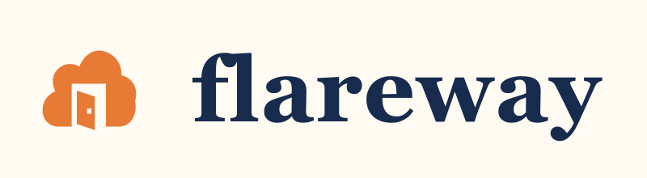
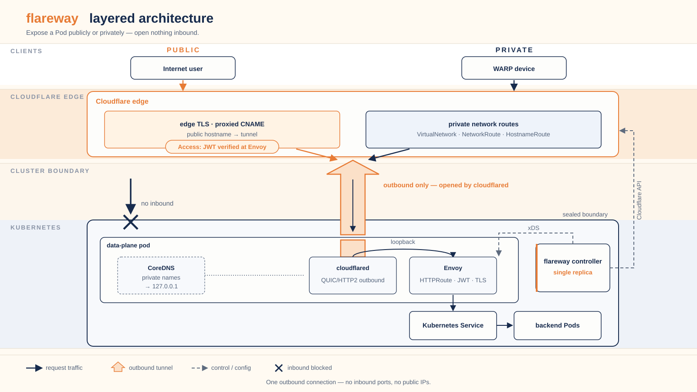

# Flareway



A Kubernetes operator for Cloudflare Tunnel, Access & WARP.

> **Status: experimental.** Flareway is `v1alpha1`. The controller runs a single
> replica with serialized reconciliation, and some Cloudflare edge and WARP
> behaviors are still under live verification. Do not run it as production
> ingress yet.

## What it does

Flareway implements the Kubernetes Gateway API (`gateway.networking.k8s.io/v1`)
on top of Cloudflare's edge. A `Gateway` you declare in the cluster becomes a
Cloudflare Tunnel; `HTTPRoute` rules become L7 routing; Cloudflare Access
policies attach to routes through the standard policy-attachment model
(GEP-713). Everything is declarative: the controller reconciles Kubernetes
resources into Cloudflare configuration, tracks ownership, and requires
explicit adoption of existing remote resources.

## Why it is useful

Cloudflare Tunnel gives a cluster inbound reachability without opening inbound
firewall ports or assigning public IPs to cluster nodes, but `cloudflared`
alone matches only hostnames and simple paths. It cannot evaluate HTTP
methods, query parameters, header matches, or weighted canary splits. Flareway
pairs `cloudflared` with an in-pod Envoy data plane so the tunnel handles
transport while Envoy handles supported `HTTPRoute` matches and filters.

Beyond that baseline, use it when you want:

- Standard `Gateway`/`HTTPRoute` resources instead of tunnel-specific config.
- Cloudflare Access (Zero Trust) policies declared next to the routes they
  protect.
- Private services reachable over WARP, managed as Kubernetes resources.

It is not a fit when you need production-grade ingress today, a highly
available controller, or Gateway API features the implementation does not
support yet — see [Conformance and testing](#conformance-and-testing).

## How it works

Each `Gateway` maps to one `CloudflareTunnel` and one data-plane Deployment.
The pod runs `cloudflared` and Envoy, plus a CoreDNS sidecar when the Gateway
has private listeners:

- `cloudflared` opens outbound QUIC/HTTP2 connections to Cloudflare's edge.
  No inbound ports or public IPs are required.
- Envoy receives decrypted requests from `cloudflared` over loopback and
  applies the routing rules the controller streams to it over xDS (Delta ADS):
  path, header, query, and method matching, rewrites, and weighted backends.
- A CoreDNS sidecar is added for Gateways with private listeners. It resolves
  private hostnames to `127.0.0.1` so WARP private traffic also flows through
  Envoy.

<picture>
  <source media="(prefers-color-scheme: dark)" srcset="assets/architecture/layers-dark.svg">
  
</picture>

Both exposure modes ride that one outbound connection: public hostnames reach
it through the Cloudflare edge, and WARP devices reach it through a private
network route. Nothing listens for inbound traffic on the cluster side. For
the same picture in Kubernetes-object terms — node, controller pod, and the
data-plane pod's containers — see the
[cluster topology diagram](assets/architecture/topology.svg).

When an `AccessApplication` targets a route, the controller configures the
matching Cloudflare Access application and policy, and configures Envoy's
`jwt_authn` filter to verify the `Cf-Access-Jwt-Assertion` token against
Cloudflare's JWKS endpoint. Routes without an Access attachment carry no JWT
filter.

For public listeners, Cloudflare owns edge TLS: Flareway creates proxied CNAME
records pointing to the tunnel hostname, marks ownership in the record
comment, and rejects a listener that references its own certificates. Private
listeners are the reverse — Envoy terminates TLS, so `certificateRefs` is
required and must name a Secret you supply (cert-manager or an internal CA;
Flareway does not issue certificates). WARP clients then reach the service
through Cloudflare's private network routes.

`CloudflareTunnel` also supports a Direct mode that owns the complete remote
`cloudflared` configuration for non-Gateway services such as TCP, SSH, RDP,
and bastion origins.

The full model, including ownership, adoption, and fail-closed behavior, is in
the [design document](docs/design/001-cloudflare-gateway-api-integration.md).

## Try it: render the manifests

Rendering the chart needs no cluster and no Cloudflare credentials. It prints
what an install would create, so you can read it before anything runs.

Prerequisite: Helm 4.3 or a compatible Helm 3 client.

```sh
helm template flareway ./charts/flareway \
  --namespace flareway-system \
  --set gatewayClass.create=true
```

This prints the controller Deployment, RBAC, Services, NetworkPolicies, and —
because `gatewayClass.create=true` — a `GatewayClass/flareway` plus its
`GatewayClassConfig/default`. Add `--include-crds` to also render the 22
Flareway CRDs the chart bundles. `gatewayClass.create` defaults to `false` so
an install cannot silently take ownership of an existing `GatewayClass`.

To go further, the [installation guide](docs/operations/install.md) covers the
real prerequisites — Gateway API v1.6.2 Standard CRDs, a Cloudflare account
and scoped API token, a DNS zone for public listeners, WARP prerequisites for
private listeners — and the `helm upgrade --install` commands for a checkout
and for the OCI chart once a release is published. Working example manifests,
credential Secret, `CloudflareAccount` grant, tunnel, Gateway, and Access
resources, are in [`config/samples/`](config/samples/); every ID, token, and
hostname in them is a placeholder you must replace before applying.

## Capabilities

Flareway ships 22 CRDs in `flareway.bhyoo.com/v1alpha1`, grouped by area:

- **Gateway and account** — `GatewayClassConfig`, `CloudflareAccount`,
  `CloudflareTunnel`: scoped API credentials, per-namespace grants, tunnel
  lifecycle, and managed DNS.
- **Access** — applications, policies, groups, identity providers, device
  posture, service tokens.
- **Private networking** — `VirtualNetwork`, `NetworkRoute`, `HostnameRoute`,
  `WARPConnector` for WARP reachability and k8s-to-VPC site-to-site links.
- **Account-wide settings** — device profiles and settings, Zero Trust
  organization, gateway policies, and lists.

The [API reference](docs/api-reference.md) documents every kind; the generated
CRDs in `config/crd/bases/` are the schema source of truth.

## Conformance and testing

The [Gateway API conformance report](conformance/reports/v1.6.2/flareway/README.md)
records a local `dev` run on a kind cluster: GatewayHTTP Core passed 37/37 and
the claimed Extended features passed 30/30. Two caveats matter:

- The run used `conformanceMode`, which disables Cloudflare Tunnel, DNS,
  Access, and WARP entirely. It validates Gateway API behavior through Envoy,
  not the Cloudflare edge path.
- The report lists 13 unsupported features (for example `ListenerSet` and
  `HTTPRouteRetry`).

End-to-end tests against a real Cloudflare account cover the edge path
(tunnels, DNS, Access) and, on a registered WARP runner, private networking.
Some live behaviors remain unverified: whether the edge accepts a `127.0.0.1`
answer for private hostnames, and long-streaming limits. See
[troubleshooting](docs/operations/troubleshooting.md) for the current state.

## Security model

Two authorization layers both must allow an operation: Kubernetes RBAC for the
controller, and `CloudflareAccount.spec.grants` for which namespaces,
hostnames, zones, and exposures may use an account. Flareway fails closed on
denial, requires explicit `AdoptById` adoption for existing remote objects,
keeps credentials in Secrets and out of status, and reports a Gateway
`Programmed` only after edge DNS, tunnel sessions, xDS configuration, and the
Envoy data plane have all converged. Details:
[RBAC and API tokens](docs/operations/rbac-token.md).

## Documentation

- [Installation](docs/operations/install.md)
- [Upgrade](docs/operations/upgrade.md)
- [RBAC and Cloudflare API tokens](docs/operations/rbac-token.md)
- [Troubleshooting](docs/operations/troubleshooting.md)
- [API reference](docs/api-reference.md) and [kubectl explain guide](docs/api/README.md)
- [Design document](docs/design/001-cloudflare-gateway-api-integration.md)
- [Gateway API conformance report](conformance/reports/v1.6.2/flareway/README.md)
- [Example manifests](config/samples/)

## License

Copyright 2026 Byeonghoon Yoo. Licensed under the Apache License, Version 2.0.
See [LICENSE](LICENSE) for details.
