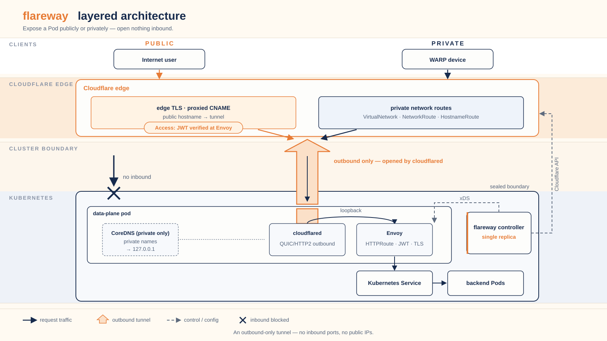
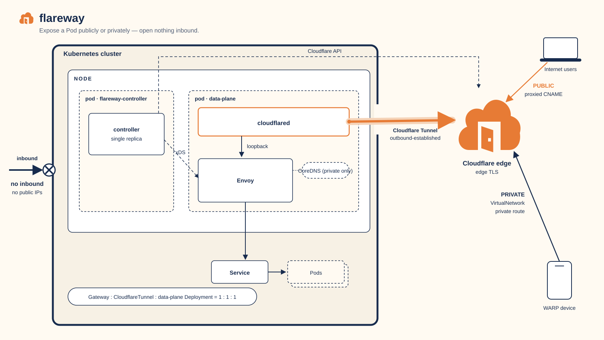

# How Flareway works: Cloudflare Tunnel and Envoy

Each `Gateway` becomes a Cloudflare Tunnel that dials out, so the cluster needs no inbound ports or public IPs, and an in-pod Envoy runs the `HTTPRoute` rules.

## One Gateway, one tunnel, one data plane

A `Gateway` names its `CloudflareTunnel` through the standard
`spec.infrastructure.parametersRef`, with no annotations:

```yaml
apiVersion: gateway.networking.k8s.io/v1
kind: Gateway
metadata:
  name: public
  namespace: default
spec:
  gatewayClassName: flareway
  infrastructure:
    parametersRef:
      group: flareway.bhyoo.com
      kind: CloudflareTunnel
      name: public
```

Flareway then runs one data-plane Deployment for that Gateway. Each pod holds
`cloudflared` and Envoy, plus a CoreDNS sidecar when the Gateway has private
listeners:

- `cloudflared` opens outbound QUIC or HTTP/2 connections to Cloudflare's edge.
- Envoy receives decrypted requests from `cloudflared` over loopback and
  applies the routing rules the controller streams to it.
- The CoreDNS sidecar answers private hostnames with `127.0.0.1`, so WARP
  traffic also passes through Envoy.

<picture>
  <source media="(prefers-color-scheme: dark)" srcset="../../assets/architecture/layers-dark.svg">
  
</picture>

Public hostnames reach the tunnel through the Cloudflare edge, and WARP
devices reach it through a private network route. Nothing on the cluster side
listens for inbound traffic from the internet.

The same system in Kubernetes-object terms shows the node, the controller pod,
and the data-plane pod's containers:



## Transport and routing

`cloudflared` carries transport only. Flareway writes its ingress rules so that
each public hostname forwards to a loopback Envoy port, one port per hostname
or Access protection domain. A hostname that must stay blocked gets a
`http_status:403` rule instead.

Envoy does the routing. The controller compiles `HTTPRoute` rules into Envoy
listeners and route tables and streams them over xDS (Delta ADS). Matching,
rewrites, redirects, mirrors, timeouts, and weighted splits therefore run in
Envoy, beyond what `cloudflared` ingress rules can express.
[HTTP routing](http-routing.md) lists what is supported.

The data plane runs the upstream `cloudflared` and Envoy images; a Gateway with
private listeners also runs a CoreDNS sidecar. The chart defaults pin each image
by digest. Flareway does not fork them.

## Public and private listeners

On a public listener, Cloudflare owns edge TLS. Flareway creates a proxied
CNAME record that points to the tunnel hostname and marks its ownership in the
record comment. A public listener that references its own certificates is
rejected.

A private listener works the other way. Envoy terminates TLS, so the listener
must use `HTTPS` and name a `certificateRefs` Secret you supply, for example
from cert-manager or an internal CA. Flareway does not issue certificates. The
matching `CloudflareTunnel.spec.listeners[]` entry sets `exposure: Private`,
and a `HostnameRoute` or `NetworkRoute` sends WARP traffic to the tunnel.
Whether the Cloudflare edge accepts the `127.0.0.1` answer for a private
hostname has not been verified live; see [Limits](limits.md).

## Access on routes

When an `AccessApplication` targets a listener or route, Flareway creates the
Cloudflare Access application and policy at the edge and verifies the Access
JWT again at the origin: `cloudflared` and Envoy check it for public
hostnames, and Envoy checks it for private ones.
[Security model](security-model.md) covers the defaults, the blocked state
before the AUD tag is known, and what happens when a policy is deleted.

## Gateway mode and Direct mode

Every tunnel has exactly one writer for its remote configuration.
`CloudflareTunnel.spec.configuration.mode` defaults to `Gateway`, where the
Gateway controller owns the whole configuration. Gateway ownership is bound to
the Gateway's UID: a second Gateway cannot take over the tunnel until the
current owner is removed and its connector Pods drain.

`Direct` mode hands the whole configuration to you. You write the ingress
rules under `configuration.direct.ingress`, and each rule selects one service
type such as `http`, `tcp`, `ssh`, `rdp`, or `bastion`. Use it for origins
that are not behind a Gateway; see [Direct tunnels](../get-started/direct-tunnels.md).

## The object map

Standard Gateway API objects and Flareway resources reference each other
like this:

- `GatewayClass` → `GatewayClassConfig` (`spec.parametersRef`), which names a
  `CloudflareAccount` (`spec.accountRef`).
- `Gateway` → `CloudflareTunnel` (`spec.infrastructure.parametersRef`), which
  names a `CloudflareAccount` (`spec.accountRef`).
- `HTTPRoute` → `Gateway` (`spec.parentRefs`).
- `AccessApplication` → a `Gateway` listener or an `HTTPRoute`
  (`spec.targetRefs`).

Flareway's own resources are in the `flareway.bhyoo.com/v1alpha1` API group:

| Area | Resources |
|---|---|
| Gateway and account | `GatewayClassConfig`, `CloudflareAccount`, `CloudflareTunnel` |
| Access | `AccessApplication`, `AccessStandaloneApplication`, `AccessPolicy`, `AccessGroup`, `IdentityProvider`, `AccessCustomPage`, `DevicePostureRule`, `DevicePostureIntegration`, `AccessInfrastructureTarget`, `ServiceToken` |
| Private network | `VirtualNetwork`, `NetworkRoute`, `HostnameRoute`, `WARPConnector` |
| Account-wide settings | `DeviceProfile`, `DeviceSettings`, `ZeroTrustOrganization`, `ZeroTrustGatewayPolicy`, `ZeroTrustList` |

The [API reference](../reference/api.md) documents every field.

## Architecture decisions

The [architecture decision records](../adr/README.md) explain why Flareway is
built this way. Start with
[ADR 0001: Gateway API on Cloudflare Tunnel](../adr/0001-gateway-api-on-cloudflare.md)
for the overall model; the tunnel status contract is in
[ADR 0004: One field manager for tunnel conditions](../adr/0004-tunnel-status-condition-ownership.md).
