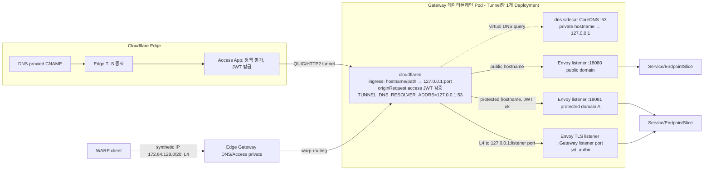

# Flareway 설계 001 — Cloudflare(cloudflared · Access · WARP)와 Kubernetes Gateway API의 통합 모델

- 작성일: 2026-09-13
- 구현 동기화: 2026-09-23
- 상태: 구현된 `v1alpha1` 계약. 이 문서는 기능 경계와 소유권을 설명하며, 필드 이름·enum·기본값의 최종 기준은 `config/crd/bases/`의 생성 CRD다.
- 입력: `docs/research/01..10-*.md`, `config/crd/bases/`, 구현 및 검증 결과.
- API group: `flareway.bhyoo.com`. controllerName: `flareway.bhyoo.com/gateway-controller`.
- 표기: 리서치 보고서 인용은 `[R1]`..`[R10]`(문서 끝 §14). 사용자 확정 결정은 `[U]`, 설계 결정은 `[D]`, 실계정/Edge 검증이 남은 항목은 `[live-blocked]`.

---

## 0. 이 문서에서 확정된 사용자 결정 `[U]`

| ID | 결정 |
|---|---|
| U-1 | 산출물 위치: `flareway` 저장소 `docs/`. |
| U-2 | API group `flareway.bhyoo.com`. |
| U-3 | WARP/조직 전역 설정도 Tunnel/Access와 동일 깊이로 설계. |
| U-4 | D-02 conformance: **2단계 검증** — 클러스터 내부 Envoy 경로로 공식 GatewayHTTP suite 통과·report 제출, Cloudflare Edge 경유는 별도 e2e. 두 결과를 문서에서 구분 표기. |
| U-5 | Kind 명명: 접두어는 `CloudflareAccount`, `CloudflareTunnel`에만 사용한다. 그 외 Kind는 사용자가 승인한 목록(§6 표) 그대로이며, 일부(`IdentityProvider`, `VirtualNetwork`, `DeviceProfile`)는 타 프로젝트 Kind와 이름이 겹칠 수 있으나 API group이 달라 충돌하지 않는다. |
| U-6 | Gateway↔Tunnel: **1 Gateway = 1 Tunnel**. `Gateway.spec.infrastructure.parametersRef`는 선택. 생략 시 Gateway 이름으로 `CloudflareTunnel` 자동 생성(ownerReference, `deletionPolicy: Delete`). |
| U-7 | DNS: 별도 CRD 없음. `CloudflareTunnel.spec.dns`로 통합. Public 리스너가 하나라도 있으면 `Gateway.status.addresses`에 `Hostname`을 공개하고, Private 전용이면 빈 배열. |
| U-8 | WARP private 노출 모델 **A**: 노출 경로(Public/Private)는 리스너 단위로 플랫폼이 `CloudflareTunnel.spec.listeners[]`에 선언. 테넌트 표면은 `HTTPRoute` + 단일 `AccessApplication`. |
| U-9 | hostname 없는 L4/IP:port 사설 노출 포함: `NetworkRoute`/`HostnameRoute` + `AccessApplication.spec.destinations[]`의 typed `Private` variant. |
| U-10 | private hostname의 클러스터 내 해석: **Pod-local DNS sidecar + `TUNNEL_DNS_RESOLVER_ADDRS`** 채택(§9.4.2). CoreDNS 동작은 M0에서 로컬 측정했으며, Edge가 loopback 응답을 수용하는지는 D-11로 별도 표시한다. |

---

## 1. 요약 — 핵심 결정 12개

1. **데이터플레인 = upstream `cloudflared` + Envoy, 같은 Pod, Envoy는 Cloudflare 모드에서 기본 loopback 전용.** cloudflared 네이티브 ingress는 hostname + 비앵커 Go regex path만 매칭하며 header/method/query/weight/rewrite/redirect/mirror가 없다 [R2]. GatewayHTTP Core는 이를 요구한다 [R1]. 따라서 cloudflared는 "Edge→Pod 전송 + per-hostname origin JWT 검증"만 담당하고, HTTPRoute 의미론은 Envoy가 처리한다. Private listener의 검증된 fallback과 conformance mode만 Pod IP 바인딩을 쓴다. (기획서 §6.1과 일치, 리서치로 확정.) `[D]`
2. **1 Gateway : 1 Tunnel : 1 데이터플레인 Deployment.** Tunnel config는 whole-object `PUT`(단일 작성자) [R2]. Gateway가 집계 단위이므로 Tunnel을 Gateway에 1:1 고정하면 aggregator가 불필요하다. `[U-6]`
3. **확장점은 Gateway API 표준 3종만: `parametersRef`(인프라) · GEP-713 `targetRefs`(정책) · 표준 필드. annotation은 Gateway API 리소스에서 읽지 않는다(zero-annotation).** Gateway API 프로젝트가 정책용 annotation을 명시적으로 비권장하고 [R1][R6], Envoy Gateway가 zero-annotation, ngrok은 Gateway 레벨에만 허용, STRRL은 ADR로 Access annotation을 거부했다 [R5][R7]. Ingress 지원 단계에서만 annotation 키를 예약한다(§7).
4. **Access 앱은 용도에 따라 두 Kind로 분리한다.** `AccessApplication`은 GEP-713 Direct policy로 `Gateway`/`HTTPRoute` target을 Cloudflare public/private destination으로 컴파일하고, 필요하면 typed private/MCP/Worker destination을 더한다. `AccessStandaloneApplication`은 Gateway에 붙지 않는 SaaS, Bookmark, Infrastructure, AppLauncher, WARP enrollment, BISO, DashSSO, MCPPortal 앱을 관리한다. 두 Kind 모두 `accountRef`, PascalCase `type`, 그리고 그 type과 일치하는 variant를 필수로 둔다. `[D]`
5. **origin JWT 검증은 보호 hostname마다 `config.ingress[].originRequest.access{required,teamName,audTag}`로 강제(기본 Required).** AUD는 앱 응답에서 획득(앱 수명 동안 불변) [R3], teamName은 `/access/organizations`의 `auth_domain` 첫 레이블에서 파생한다 [R3]. Private(WARP) 경로는 cloudflared 미들웨어가 없으므로 Envoy `jwt_authn`이 대신하며 Gateway TLS decryption이 전제(§9.4.3).
6. **보호 영역(protection domain)별로 cloudflared ingress rule과 Envoy 리스너를 분리하며 기본 바인딩은 loopback.** 같은 hostname에서 공개 Q가 보호 P와 서로소이거나 P가 Q를 포함할 때만 혼합을 허용한다. P⊇Q이면 Flareway가 Q마다 더 구체적인 child bypass Access application을 관리한다(§9.2). 그 밖의 혼합은 `Accepted=False`로 차단한다. `[D]`
7. **DNS는 Tunnel 속성.** listener hostname마다 `<tunnel-id>.cfargotunnel.com` proxied CNAME(wildcard listener→wildcard record)을 만들고, 100자 이하의 결정적 `comment`로 소유권을 기록한다 [R2]. DNS tag는 계정별 quota와 사전 생성 제약이 있으므로 소유권에 사용하지 않는다. `dns.mode: External`이면 external-dns에 위임한다 [R5]. Public 리스너가 하나라도 있으면 `status.addresses`에 `Hostname`을 공개하고, Private 전용이면 빈 배열. `[U-7]`
8. **Edge TLS는 Cloudflare 소유.** Public 리스너의 `tls.certificateRefs`는 거부(`Accepted=False/UnsupportedValue`, 사유 §4.2). Private 리스너는 Envoy가 종료하므로 `certificateRefs` **필수**. `[D]`
9. **전역 전체-교체 API(device profile include/exclude/fallback, 계정 device settings, organization)는 각각 단일 소유 CRD가 집계.** per-route reconcile이 직접 호출하지 않는다 [R4].
10. **소유권 ledger: Cloudflare 측 metadata(`tags`/`comment`/`name` prefix) + status remote ID + 명시적 `adoption`.** 이름 일치만으로 인수하지 않는다. `managementPolicy: Managed|ObserveOnly`, `deletionPolicy: Delete|Orphan` 공통. `[D]`
11. **테넌트 경계는 `CloudflareAccount.spec.grants[]`가 통제**(namespace selector × hostname suffix × zone × exposure). 정책 CR은 target과 같은 namespace만(GEP-713 권고, Istio/Envoy Gateway 관행 [R6]). `[D]`
12. **conformance 2단계** `[U-4]`: (a) `flareway-conformance` 모드(Edge 없이 Envoy 직결)로 공식 suite, (b) Cloudflare 실계정 e2e(hostname/DNS/TLS/Access/JWT/WARP). 어느 쪽도 상대를 대신 주장하지 않는다.

---

## 2. 리서치가 확정한 사실 (설계 근거)

| # | 사실 | 출처 |
|---|---|---|
| F-1 | Gateway API 최신 v1.6.2(2026-09-03), K8s 1.32–1.36 지원. `ListenerSet`·`TLSRoute/TCPRoute/UDPRoute`·`BackendTLSPolicy` Standard. `CORS` 필터 Standard. `ExternalAuth` 필터(GEP-1494)·`retry`·`XBackendTrafficPolicy` Experimental. | [R1] |
| F-2 | GEP-713: Direct policy는 `targetRefs[]`(`LocalPolicyTargetReferenceWithSectionName`), 상태는 `status.ancestors[]`(`PolicyAncestorStatus`), CRD 라벨 `gateway.networking.k8s.io/policy: Direct`. 충돌 시 오래된 생성 timestamp 승, 패자는 `Accepted=False/Conflicted`. cross-namespace target은 ReferenceGrant 동등 handshake 없이는 금지. | [R1][R6] |
| F-3 | 미지원 필드 표준 처리: 전체 거부 `Accepted=False`+`UnsupportedValue`; 일부 rule만 무효면 `PartiallyInvalid=True`+메시지 `"Dropped Rule"` 또는 `"Fall Back"`. | [R1] |
| F-4 | 클라우드 edge 구현은 `status.addresses[].type: Hostname`을 사용(AWS ELB, ngrok, lexfrei). 어떤 SaaS-edge 구현도 공식 conformance report를 제출한 적 없음. suite는 `status.addresses[0]:port`로 직접 dial하며 임의 Host(`example.com`)를 보냄. | [R1][R6][R7] |
| F-5 | Tunnel config: `PUT /accounts/{a}/cfd_tunnel/{t}/configurations`, `config.ingress[]{hostname,path,service,originRequest}`, `config.originRequest`, `config.warp-routing.enabled`. 전체 교체, `version` 정수 반환, 조건부 헤더 없음. Edge가 cloudflared에 push(수초 내). 마지막 rule은 catch-all 필수. | [R2] |
| F-6 | cloudflared ingress 매칭: hostname exact 또는 `*.x` suffix match(`strings.HasSuffix`, apex 제외)라 `*.example.com`은 `a.b.example.com`에도 매치한다. Gateway API wildcard도 여러 레이블과 매치하지만 [R1], Access destination wildcard는 한 레이블만 매치한다 [R3]. path는 **비앵커** Go regex, 첫 매치이며 `service` 스킴은 http/https/tcp/ssh/rdp/smb/unix/unix+tls/hello_world/http_status/bastion이다. path rewrite는 없다. | [R2] |
| F-7 | `originRequest.access{required, teamName, audTag[]}`: `Cf-Access-Jwt-Assertion` 헤더만 검사(쿠키 무시), JWKS `https://<team>.cloudflareaccess.com/cdn-cgi/access/certs` 캐시, 실패 시 403. rule별 설정이 top-level을 통째로 override. HTTP/HTTPS와 HTTP-over-UNIX(`unix`, `unix+tls`) origin에 적용하며 raw TCP/WARP에는 적용하지 않는다. | [R2] |
| F-8 | Tunnel 생성 `POST /cfd_tunnel {name, config_src:"cloudflare"}`, 토큰 `GET .../token`, 삭제 `DELETE ...?cascade=true`. 상태 `inactive/healthy/degraded/down`. `/ready`(200/503), `/metrics`, `--grace-period`(기본 30s, 최대 3m). 계정당 tunnel 1,000, tunnel당 connector 25. | [R2] |
| F-9 | DNS: `<tunnel-id>.cfargotunnel.com` CNAME, `proxied: true` 필수. record `comment`(≤100자), `tags[]` 지원. Universal SSL은 apex+1단계까지; `*.a.example.com` 다단계는 ACM 필요. | [R2] |
| F-10 | Access Application wire types는 `self_hosted, saas, ssh, vnc, rdp, mcp, proxy_endpoint, bookmark, infrastructure, app_launcher, warp, biso, dash_sso, mcp_portal`이다. `destinations[]`는 public/private/MCP/Worker variants를 제공하고 `self_hosted_domains`는 deprecated다. `aud`는 앱 수명 동안 불변이며 path는 더 구체적 앱이 우선하고 상속되지 않는다. | [R3] |
| F-11 | Access Policy(재사용, `/access/policies`): `decision: allow|deny|non_identity|bypass`, `include[]`(OR)/`require[]`(AND)/`exclude[]`(AND NOT), 규칙 타입 `email, email_domain, email_list, everyone, ip, ip_list, certificate, common_name, group, azureAD, github-organization, gsuite, okta, saml, oidc, service_token, any_valid_service_token, external_evaluation, geo, auth_method, device_posture, login_method, auth_context, linked_app_token, user_risk_score, cloudflare_account_member`. WARP 조건은 `device_posture`(type `warp`/`gateway` posture check) 참조로 표현. 평가: bypass/non_identity 먼저, 그 다음 allow/deny를 precedence 순, 첫 매치 종료. 정책/그룹/토큰엔 `tags` 없음(name만). | [R3] |
| F-12 | Access org: `GET/PUT /access/organizations` → `auth_domain`, `session_duration`, `warp_auth_session_duration`, `allow_authenticate_via_warp`, `is_ui_read_only`. JWT: RS256, 키 6주 회전+7일 grace. Edge 폐기 전파 20–30s; **cloudflared는 stateless 검증이라 폐기 토큰을 `exp`까지 수용**. | [R3] |
| F-13 | Service token: `client_id`/`client_secret` 생성 시 1회 반환, `/rotate`(`previous_client_secret_expires_at`), `/refresh`. 헤더 `CF-Access-Client-Id/Secret`. | [R3] |
| F-14 | Device profile: default `PATCH /devices/policy`, custom `POST /devices/policy`·`PATCH /devices/policy/{id}`. split tunnel `PUT .../exclude|include`, `PUT .../fallback_domains` **전체 교체**, include/exclude는 profile당 배타. split tunnel + fallback domains 합산 profile당 1,000 entries, 계정당 profile 30. | [R4] |
| F-15 | 계정 device settings `GET/PUT/PATCH /devices/settings{gateway_proxy_enabled, gateway_udp_proxy_enabled, root_certificate_installation_enabled, use_zt_virtual_ip, disable_for_time}` — org/profile과 별개 API. | [R4] |
| F-16 | Tunnel routes `POST /teamnet/routes{network, tunnel_id, virtual_network_id, comment}`; VNet `POST /teamnet/virtual_networks{name, comment, is_default_network}`. 같은 VNet 내 CIDR 중첩 거부. 계정당 route 1,000, VNet 1,000. | [R4] |
| F-17 | Private hostname route GA: `POST /accounts/{a}/zerotrust/routes/hostname{hostname, tunnel_id, comment}`. Gateway DNS가 synthetic IP `172.64.128.0/20`(v6 `2606:4700:0cf1:4000::/64`)를 클라이언트에 주고, 동시에 tunnel을 통해 cloudflared의 virtual DNS 서비스(`2606:4700:0cf1:2000::1:53`)에 hostname을 질의해 origin IP를 얻는다. 이후 L4 flow는 Edge가 목적지를 그 IP:port로 재작성해 보내고 cloudflared는 `netip.ParseAddrPort`로 파싱해 그대로 dial한다(hostname 해석 없음). 전제: `gateway_proxy_enabled`+`gateway_udp_proxy_enabled`, WARP ≥2025.4.929, cloudflared ≥2025.7.0. Terraform v5.25에 전용 리소스 없음. | [R4][R8] |
| F-18 | 사설 앱 identity gating: Gateway network policy(L4, 먼저 평가) → Access private destination(권장). exclude-mode profile에서 proxied public hostname은 include 불필요; include-mode면 hostname 또는 `172.64.128.0/20`을 include해야 함. | [R4] |
| F-19 | 기존 CF 오퍼레이터: cfgate(`targetRef` Access/Origin policy, DNS CRD+TXT ownership, AUD를 cloudflared에 미주입), StringKe(30+ CRD, ConfigMap aggregator 단일 작성자, `DeviceSettingsPolicy.autoPopulateFromRoutes`), lexfrei(cloudflared fork 내장 L7 proxy, v1.6.1 conformant, DNS는 external-dns 위임), adyanth(TunnelBinding), STRRL(Ingress annotation, ADR-0001로 Access annotation 거부→`CloudflareAccess` CRD). 어느 것도 AUD→`originRequest.access` 자동 연결을 하지 않음. | [R5][R7] |
| F-20 | 성숙한 구현의 관례: `parametersRef`=인프라(EnvoyProxy, NginxProxy, CiliumGatewayClassConfig), `targetRefs`=트래픽/보안(SecurityPolicy, GCPBackendPolicy, IAMAuthPolicy, RequestAuthentication), `ExtensionRef`=rule 내 인라인 변환(KongPlugin, SnippetsFilter, Middleware), annotation=클라우드 메타데이터/레거시(GKE `networking.gke.io/certmap`, `pre-shared-certs`). 인증은 예외 없이 policy attachment. | [R6] |
| F-21 | external-dns Cloudflare annotation: `external-dns.alpha.kubernetes.io/cloudflare-proxied`, `cloudflare-custom-hostname`, `cloudflare-region-key`, `cloudflare-record-comment`, `cloudflare-tags`. Gateway source는 listener∩route hostname과 `status.addresses`를 읽음. | [R5] |
| F-22 | Cloudflare Edge 제한: 응답 헤더 대기 100s(Enterprise 최대 6,000s), 본문 100MB(Free/Pro)/200MB/500MB, WebSocket 유휴 100s, SSE는 버퍼링 회피 필요. | [R2] |

---

## 3. 아키텍처

### 3.1 트래픽 경로



- Public 경로: Edge TLS → Access → tunnel → cloudflared ingress rule(hostname/path) → **보호 영역별 Envoy loopback 리스너** → HTTPRoute 컴파일 결과 → backend.
- Private 경로(WARP): WARP 클라이언트의 DNS 질의를 Edge Gateway가 가로채 synthetic IP를 주고, 동시에 tunnel을 통해 cloudflared의 virtual DNS 서비스(`2606:4700:0cf1:2000::1:53`)로 hostname을 질의한다. cloudflared는 이를 `TUNNEL_DNS_RESOLVER_ADDRS`가 가리키는 **Pod 내 DNS sidecar**로 넘기고, sidecar가 `127.0.0.1`을 답한다. 이후 Edge는 원래 private destination port를 보존한 `127.0.0.1:<listener.port>`로 L4 flow를 보내고 cloudflared가 그대로 dial한다 [R8]. Envoy는 **Gateway listener의 선언 port**에서 TLS를 종료하고 동일 HTTPRoute 컴파일 결과를 적용한다. 별도 1844x 포트를 쓰면 Cloudflare Access `portRange`와 실제 L4 목적지가 어긋나므로 사용하지 않는다. cloudflared JWT 미들웨어는 없고(F-7), 대신 Envoy `jwt_authn`이 검증한다(§9.4).
- Cloudflare 모드의 Envoy listener와 DNS sidecar는 기본적으로 loopback(`127.0.0.1`)에만 바인딩한다. D-11 fallback은 Private listener만 Pod IP에도 바인딩하고 NetworkPolicy로 차단하며, conformance mode는 §12.2대로 직접 도달 가능한 포트에 바인딩한다. 그 외 Pod 외부 도달 가능 port는 metrics/health뿐이다.

### 3.2 제어평면 컨트롤러 (기능군별 on/off, 기획서 §11.1)

| 컨트롤러 | 입력 | 출력(원격) | 출력(클러스터) |
|---|---|---|---|
| gateway/tunnel | GatewayClass, Gateway, HTTPRoute, ReferenceGrant, BackendTLSPolicy, CloudflareTunnel | Tunnel lifecycle, Gateway-compiled config or Direct whole-object config, DNS record | Deployment(cloudflared+Envoy), Service, PDB, NetworkPolicy, CoreDNS ConfigMap, Delta ADS/SDS snapshot, connector/management-token Secrets |
| access | AccessApplication, AccessStandaloneApplication, AccessPolicy, AccessGroup, IdentityProvider, AccessCustomPage, DevicePostureRule, DevicePostureIntegration, AccessInfrastructureTarget, ServiceToken | apps/policies/groups/idps/custom_pages/posture/integrations/targets/service_tokens | AUD, SaaS client, SCIM, and service-token Secrets; status |
| private-network | VirtualNetwork, NetworkRoute, HostnameRoute, WARPConnector | teamnet routes, virtual networks, hostname routes, WARP Connector tunnel/HA/failover | connector-token Secret, platform-created HostnameRoute when granted |
| device | DeviceProfile, DeviceSettings | devices/policy(+include/exclude/fallback), devices/settings | status |
| organization | ZeroTrustOrganization, ZeroTrustGatewayPolicy, ZeroTrustList | access/organizations, gateway/rules, gateway/lists | status |
| account | CloudflareAccount | token/zone/organization 검증(read) | verified status와 grant 판단 입력 |

원격 write는 account별 직렬화 + rate limit(사용자/API token별 1,200 req/5min [R3]) + leader election. 여러 `CloudflareAccount` token은 하나의 budget을 공유하지 않는다. 두 클러스터 동시 소유는 원격 ledger 검증으로만 탐지(§10).

---

## 4. Gateway API 계약

### 4.1 GatewayClass

```yaml
apiVersion: gateway.networking.k8s.io/v1
kind: GatewayClass
metadata: {name: flareway}
spec:
  controllerName: flareway.bhyoo.com/gateway-controller
  parametersRef: {group: flareway.bhyoo.com, kind: GatewayClassConfig, name: default}   # 선택
```

- `GatewayClassConfig`(cluster-scoped, §6.2)가 없으면 내장 기본값. 없는 것을 참조하면 `Accepted=False/InvalidParameters`(F-1 표준 사유).
- `status.supportedFeatures`에 §4.4 지원표를 그대로 게시한다 (v1.6 `SupportedFeatures` 필드). `[unverified: v1.6.2 GatewayClass.status.supportedFeatures 채널 확인 필요]`
- 기존 GKE GatewayClass는 건드리지 않는다(기획서 §6.2).

### 4.2 Gateway ↔ CloudflareTunnel

| Gateway 필드 | Flareway 해석 | 거부/조건 |
|---|---|---|
| `spec.infrastructure.parametersRef` → `CloudflareTunnel`(같은 ns) | 이 Gateway의 tunnel·데이터플레인·DNS·리스너 노출 설정. 생략 시 `CloudflareTunnel/<gateway-name>` 자동 생성 `[U-6]`. Tunnel controller는 선택한 owner를 `status.gatewayRef`와 `status.gatewayUid`의 exact pair로 checkpoint한다. | 다른 Gateway가 이미 소유한 Tunnel 참조 → `Accepted=False/InvalidParameters`, 메시지 "tunnel owned by <ns/gw>". 기록된 UID가 살아 있고 삭제 중이 아니면 더 오래된 Gateway가 나중에 참조해도 preempt할 수 없다. |
| owner release·삭제·재생성 | 기록된 exact Gateway UID가 참조를 해제하거나 삭제되면 그 UID의 기존 cloudflared Deployment를 먼저 0으로 scale하고 관련 Pod가 종료된 뒤 successor UID를 checkpoint한다. 같은 이름의 재생성 Gateway는 이전 `gatewayUid`를 승계하지 않는다. | drain 전 successor의 token, Deployment, remote config, DNS, Tunnel/Gateway status write를 차단한다. |
| auto-created ↔ explicit Tunnel 전환 | 현재 Tunnel의 `deletionPolicy: Orphan`일 때만 허용. 보호 rule 403 → 새 Tunnel Ready → DNS 재지정 → 이전 Tunnel orphan 순으로 block-first 전환. | 그 외 `Accepted=False/InvalidParameters`, 메시지 "tunnel switch requires deletionPolicy: Orphan on the current tunnel". |
| `spec.infrastructure.labels/annotations` | 데이터플레인 Deployment/Pod에 전파(`GatewayInfrastructurePropagation`). | — |
| `spec.listeners[].hostname` | **필수**(Edge/WARP 모두 hostname 기반). `*.example.com` wildcard는 apex를 제외한 여러 레이블 깊이와 매치한다(F-6). | 없음 → `Accepted=False/UnsupportedValue`. zone 기준 다단계 wildcard(`*.a.example.com`) → `Accepted=False/UnsupportedValue`(ACM 미관리, F-9). `CloudflareAccount.grants`에 없는 hostname → `Accepted=False/UnsupportedValue`+메시지 "hostname not granted". |
| `spec.listeners[].protocol/port` (Public 리스너) | `HTTPS/443`, `HTTP/80`만 의미 있음. 둘 다 Edge가 서비스. | 그 외 port → `Accepted=False/UnsupportedValue`. `TLS`(Passthrough) → `UnsupportedProtocol`. |
| `spec.listeners[].tls` (Public) | `mode: Terminate` 암묵. Edge TLS(Universal SSL). | `certificateRefs` 지정 → `Accepted=False/UnsupportedValue`, 메시지 "edge-terminated listener must not reference certificates". `tls.options["flareway.bhyoo.com/edge-tls-mode"]`(§4.2.1)만 허용. |
| `spec.listeners[].protocol/port` (Private 리스너, §6.3 `exposure: Private`) | `protocol: HTTPS`, 모든 port 허용. Envoy가 TLS를 종료하며 Access private destination의 `portRange`는 listener port에서 파생. | HTTPS 외 protocol → `Accepted=False/UnsupportedValue`. |
| `spec.listeners[].tls` (Private 리스너, §6.3 `exposure: Private`) | Envoy가 종료. `certificateRefs` **필수**(Secret, cross-ns는 ReferenceGrant). | 미지정 → `Accepted=False/UnsupportedValue`. 지정한 Secret이 없거나 유효하지 않으면 `ResolvedRefs=False/InvalidCertificateRef`. |
| `spec.listeners[].allowedRoutes` | 표준 그대로(`Same/All/Selector`, `kinds`). | `kinds`에 HTTPRoute 외 → `ResolvedRefs=False/InvalidRouteKinds`(v1 범위, §4.4). |
| `spec.addresses` | 비워야 함. | 지정 → `Accepted=False/UnsupportedAddress`. |
| `spec.allowedListeners`(ListenerSet) | v1에서 미지원: 값이 있으면 거부. | `Accepted=False/UnsupportedValue`(구현별 Gateway reason; 표준 목록엔 없음). |
| `status.addresses` | Public 리스너 존재 시 `[{type: Hostname, value: <tunnel-id>.cfargotunnel.com}]`. Private만 있으면 빈 배열. | — |
| `status.conditions.Programmed` | Tunnel `healthy` + Envoy config 적용 + (Managed일 때) DNS record 존재까지. Access 앱 대기 중 보호 리스너는 `Programmed=False/Pending`. | — |

같은 Gateway에서 같은 hostname을 Public과 Private로 함께 노출하는 것은 v1에서 금지하며, `CloudflareTunnel`은 `Accepted=False`, 메시지 "hostname exposure must be unique per Gateway"를 기록한다. 별도 hostname을 사용해야 한다.

`GatewayClassConfig.spec.conformanceMode: true`에서는 이 표의 Cloudflare Edge 제약 대신 §12.2 완화 계약을 적용한다.

#### 4.2.1 listener `tls.options`(구현별 키, 표준이 허용하는 유일한 리스너 확장점)

| 키 | 값 | 의미 |
|---|---|---|
| `flareway.bhyoo.com/edge-tls-mode` | `Full` \| `Strict`(기본 `Strict`) | 설명용/검증용. Tunnel 경유는 항상 암호화되므로 Zone SSL 모드를 Flareway가 바꾸지 않는다. `Off/Flexible` 요청 시 거부. |

리스너 충돌 규칙(F-2/R1): 같은 (port, protocol, hostname) 조합 → 양쪽 `Conflicted=True/HostnameConflict`, Gateway `Accepted=False/ListenersNotValid`.

### 4.3 HTTPRoute 컴파일

입력: Gateway에 attach된 HTTPRoute 집합(표준 hostname 교집합, `allowedRoutes`, ReferenceGrant, `CloudflareAccount.spec.grants[].backends` 검증 후). Public 리스너에서 교집합에 남은 route hostname은 Universal SSL 범위인 apex 또는 apex+1 깊이여야 한다(F-9). 더 깊으면 route `Accepted=False/UnsupportedValue`, 메시지 "hostname depth requires ACM (unsupported)".
출력 3종:

1. **Envoy 라우트 테이블** — 리스너별(보호 영역별) virtual host. 구현 우선순위는 `Exact` > `RegularExpression` > `PathPrefix`(긴 값 우선) > method 존재 > header 수 > query 수 > 오래된 `HTTPRoute` 생성 시각 > `namespace/name` > rule index > match index다. Gateway API가 regex와 다른 path type 사이의 순서를 정하지 않으므로 regex 위치를 명시적으로 고정했다. 필터 `RequestHeaderModifier`, `ResponseHeaderModifier`, `RequestRedirect`, `URLRewrite`, `RequestMirror`, `CORS`, `ExtensionRef`(§4.5), `timeouts`, `backendRefs.weight`를 컴파일한다. retry와 `sessionPersistence`는 Experimental channel이며 후속 범위다.
2. **cloudflared `config.ingress[]`** — hostname × 보호 영역 단위. 규칙:
   - hostname `h`의 전체가 하나의 보호 영역이면 `{hostname: h, service: http://127.0.0.1:<port_h>, originRequest.access{...}}` 한 줄.
   - 같은 hostname에 보호 영역이 둘 이상(예: `/admin` 보호, 나머지 public)이면 §9.2의 증명이 성공할 때만 `{hostname: h, path: "^/admin(/|$)", service: ...:port_protected, access}` + `{hostname: h, service: ...:port_public}` 두 줄. 실패를 유발한 새 객체를 §9.2 순서대로 거부하거나 drop한다.
   - path regex는 **항상 앵커(`^...`)** 하고 Envoy 정규화와 동일한 정규화 후 문자열을 사용한다(F-6 비앵커 함정 회피).
   - 마지막 `{service: http_status:404}`.
   - `originRequest`는 rule별로 완전한 객체를 써 넣는다(F-7 override 의미론).
3. **Envoy 리스너 집합** — Public 보호 영역은 18080부터 loopback 포트를 할당해 status에 기록한다. Private 보호 영역은 Cloudflare가 보존하는 **Gateway listener port**에 loopback TLS listener를 만든다.

route status: `parents[]`에 Flareway 엔트리만 갱신, 타 controller 엔트리 보존(기획서 §6.2). `Accepted`, `ResolvedRefs` 표준 사유(F-3) 사용, 부분 무효는 `PartiallyInvalid`+`"Dropped Rule"`. 기존에 성립한 보호 영역 증명을 나중 HTTPRoute가 깨면 그 route의 해당 rule을 drop하고 `PartiallyInvalid=True`로 기록하며, 전체 route가 무효면 `Accepted=False`; 기존 AccessApplication은 Accepted를 유지한다. backendRef가 ReferenceGrant를 통과해도 grant가 허용하지 않는 namespace 또는 `Service` 외 kind이면 `ResolvedRefs=False/RefNotPermitted`.

### 4.4 지원 기능표 (v1alpha1 목표)

| 기능 | 채널 | Flareway | 비고 |
|---|---|---|---|
| Gateway/HTTPRoute Core(리스너 바인딩, hostname 교집합, 80/443, Exact/PathPrefix, header exact, weight, `RequestHeaderModifier`, `RequestRedirect`, ReferenceGrant) | Core | **지원** | Envoy 처리 |
| `HTTPRouteHostRewrite`, `HTTPRoutePathRewrite`, `HTTPRouteResponseHeaderModification`, `HTTPRoutePortRedirect`, `HTTPRouteSchemeRedirect`, `HTTPRoutePathRedirect`, `HTTPRouteMethodMatching`, `HTTPRouteQueryParamMatching`, `HTTPRouteRequestMirror`, `HTTPRouteRequestTimeout`, `HTTPRouteBackendTimeout`, `HTTPRouteCORS`, `HTTPRoute303RedirectStatusCode`, `HTTPRoute307RedirectStatusCode`, `HTTPRoute308RedirectStatusCode` | Extended | **지원** | `status.supportedFeatures`에 게시 |
| `HTTPRouteRequestMultipleMirrors`, `HTTPRouteRequestPercentageMirror` | Extended | 지원 | Envoy 가능 |
| `GatewayInfrastructurePropagation` | Extended | 지원 | |
| `BackendTLSPolicy`(+SAN) | Standard | 지원 | Envoy upstream TLS |
| `HTTPRouteDestinationPortMatching`, `HTTPRouteParentRefPort` | Extended | 지원 | port 80/443만 유효 |
| `HTTPRouteRetry`, `HTTPRouteRetryBackendTimeout`, `HTTPRouteRetryConnectionError`, `XBackendTrafficPolicy`, `sessionPersistence`, `ExternalAuth` 필터 | Extended feature, Experimental channel | **미지원** → `UnsupportedValue` | Experimental CRD 미설치 전제 |
| `GatewayStaticAddresses`, `spec.addresses` | Extended | 미지원 → `UnsupportedAddress` | Edge가 주소 소유 |
| `GatewayAddressEmpty` | Extended | 지원 | Private-only Gateway는 빈 `status.addresses` 게시 |
| `GatewayHTTPListenerIsolation`, `GatewayHTTPSListenerDetectMisdirectedRequests` | Extended | 지원(Envoy) / Edge 경로에서는 해당 없음 | conformance 모드에서만 검증 |
| `ListenerSet` | Standard(1.5) | 미지원(v1) | `allowedListeners` 거부 |
| GRPCRoute, TLSRoute, TCPRoute, UDPRoute | Standard | 미지원(v1) | `InvalidRouteKinds`. 사설 L4는 `NetworkRoute`(§6.9)로 |
| `backendRefs` custom kind | — | 미지원 | `InvalidKind` |

"지원"은 conformance 모드(§12)에서 suite를 통과한 것만 게시한다.

`HTTPRoutePortRedirect`와 `HTTPRouteSchemeRedirect`는 conformance 모드에서 검증한다. Edge-served listener에서 Flareway hostname의 80/443 외 port로 redirect하면 Cloudflare Edge가 그 목적지를 서비스하지 않는다. 이는 문서화된 제한이며 route 거부 사유는 아니다.

### 4.5 `ExtensionRef` 필터

v1alpha1에서 Flareway ExtensionRef kind는 없다. 참조되면 표준대로 요청을 500으로 실패시킨다(F-2, "MUST NOT be skipped"). Cloudflare Access는 rule 내 인라인 변환이 아니라 hostname/path 경계의 edge 정책이므로 ExtensionRef가 아닌 policy attachment가 맞다(F-20).

---

## 5. 구현된 Cloudflare parity matrix

이 표는 “지원/미지원” 계획표가 아니라 현재 CRD와 컨트롤러의 소유 경계를 기록한 ledger다. **공식 API의 create/update 가능한 필드는 spec에 두고, 원격 ID·timestamp·health·`read_only` 같은 서버 소유 값은 status에만 둔다.** HTTP 응답의 `success`, `errors`, `messages`, `result`, pagination/result-info 같은 transport envelope는 Kubernetes desired state가 아니므로 CRD에 복제하지 않는다.

### 5.1 Tunnel: Gateway mode와 Direct mode

| 표면 | 구현 계약 | 소유자 |
|---|---|---|
| Tunnel lifecycle | 생성, 조회, token Secret, cascade 삭제, `ObserveOnly`, `AdoptById`, `Delete|Orphan`. Managed remote ID는 `status.ownershipVerified: true`일 때만 재사용한다. ObserveOnly에서 관측한 ID는 matching `externalRef`+`AdoptById`+`adoption.expect.name` 없이는 Managed로 전환할 수 없다. | `CloudflareTunnel` |
| `configuration.mode: Gateway` | 기본값. Gateway/HTTPRoute를 집계해 whole-object config를 작성하고 `connector`, `proxy`, `privateDNS`, `listeners`, loopback Envoy에 유효한 `originRequest` subset을 사용 | gateway/tunnel controller |
| `configuration.mode: Direct` | 명시적 opt-in. `configuration.direct.ingress[]`, top-level `originRequest`, `warpRouting`을 Cloudflare config에 그대로 단독 소유 | `CloudflareTunnel` |
| Direct ingress services | `http`, `https`, `tcp`, `ssh`, `rdp`, `smb`, `unix`, `unixTLS`, `helloWorld`, `httpStatus`, `bastion` 중 정확히 하나 | 각 `ingress[]` rule |
| Full `originRequest` | `access{audTags,teamName,required}`, `caPool`, `connectTimeout`, `disableChunkedEncoding`, `http2Origin`, `httpHostHeader`, `keepAliveConnections`, `keepAliveTimeout`, `matchSNIToHost`, `noHappyEyeballs`, `noTLSVerify`, `originServerName`, `proxyType`, `tcpKeepAlive`, `tlsTimeout`, `ipRules` | Direct top-level 또는 rule override |
| WARP routing | `enabled`, `connectTimeout`, `tcpKeepAlive`, `maxActiveFlows` | Direct: `configuration.direct.warpRouting`; Gateway: typed route 참조에서 자동 계산 |
| Management token | `resources: [Logs]`로 단기 token Secret 요청 | `spec.managementToken` |

Direct mode의 마지막 ingress rule은 hostname/path가 없는 catch-all이어야 한다. `originRequest.access`는 HTTP 계열 origin에만, `ipRules`는 `bastion` 또는 `proxyType: SOCKS5`에만 유효하다. Direct mode에서는 Gateway가 소유하는 `connector`, `proxy`, `privateDNS`, Gateway용 `originRequest`, `listeners`를 함께 쓸 수 없다. Gateway mode의 `originRequest`는 `connectTimeout`, `keepAliveTimeout`, `tcpKeepAlive`, `keepAliveConnections`, `noHappyEyeballs`, `disableChunkedEncoding`, `http2Origin`만 노출한다. `dns`는 두 mode 모두에 적용된다.

### 5.2 DNS와 account/zone scope

| 표면 | 구현 계약 |
|---|---|
| DNS ownership | `dns.mode: Managed|External`; Managed는 listener/Direct hostname CNAME을 소유하고 External은 주소만 게시 |
| Record fields | `recordComment`, `proxied`, `ttl`, `settings.ipv4Only`, `settings.ipv6Only` |
| Validation | proxied record는 automatic TTL(`1`), IP-family setting은 `proxied: true`, `ipv4Only`와 `ipv6Only`는 상호 배타 |
| Account scope | `zone` 생략 시 account endpoint 사용 |
| Zone scope | `zone`은 `CloudflareAccount.status.verified.zones`의 exact DNS name으로 ID를 해석; 확인되지 않은 zone은 원격 write 전에 거부 |
| Tenant authorization | `CloudflareAccount.spec.grants[]`가 namespace, hostname, zone, exposure, platform object, typed private route, custom page/posture integration/standalone-app 참조, backend를 각각 허용 |

### 5.3 Access applications

모든 public enum은 PascalCase다. 두 application Kind 모두 `accountRef`, immutable `type`, 그리고 type과 일치하는 variant를 요구한다.

| Kind | 구현된 type | 용도 |
|---|---|---|
| `AccessApplication` | `SelfHosted`, `SSH`, `VNC`, `RDP`, `MCP`, `ProxyEndpoint` | Gateway API target에 붙는 GEP-713 Direct policy |
| `AccessStandaloneApplication` | `SaaS`, `Bookmark`, `Infrastructure`, `AppLauncher`, `WARP`, `BISO`, `DashSSO`, `MCPPortal` | Gateway target 없이 계정/zone Access app 직접 관리 |

`AccessApplication.targetRefs[]`는 같은 namespace의 `gateway.networking.k8s.io` `Gateway` 또는 `HTTPRoute`만 받으며 `sectionName`으로 listener/rule을 고른다. `pathScope`는 target에서 파생된 hostname을 `Exact` 또는 기본 `PathPrefix` 경계로 더 좁힌다. `destinations[]`는 discriminated union으로 `Private`, `ViaMCPServerPortal`, `Worker`, `PreviewWorker`, `AllWorkers`, `AllPreviewWorkers`를 추가한다. Public destination은 `targetRefs`에서만 컴파일하며 deprecated `self_hosted_domains`는 노출하지 않는다.

`originJWT.mode`의 기본값은 `Required`다. `audienceScope: Application`은 현재 app AUD만, `Hostname`은 hostname에서 Ready인 모든 app AUD를 허용하며 `Hostname`은 `Required`와만 조합한다. Private TLS decryption을 원격에서 증명할 수 없을 때만 `assumeGatewayTLSDecryption`으로 플랫폼 책임을 명시한다.

같은 hostname의 protected parent 아래 public route가 생기면 Flareway는 child bypass app을 block-first 순서로 관리한다. 기존 child를 가져오려면 `bypass.children[]`에 정규화된 `hostname`+`path`, `externalRef.applicationId`, `adoption.mode: AdoptById`, 기대값을 명시한다. 이름 일치만으로 child를 인수하지 않으며, `ObserveOnly` parent는 모든 child에 `externalRef`가 있어야 한다.

### 5.4 Access field families와 Secret 경계

| 기능군 | 구현된 표면 |
|---|---|
| 공통 app settings | session, WARP auth, iframe/interstitial, IdP redirect/ref, launcher, service-auth 401, binding/cookie/SameSite/path, CORS, service-token header, deny pages, custom page refs, eager redirect, logo, MFA, OAuth authorization server, SCIM, clientless isolation URL, tags |
| SaaS | OIDC/SAML discriminated config, claims/attributes, grants/scopes, redirect URIs, transforms, token lifetimes; create-only client secret은 controller-owned Secret에 저장 |
| SCIM | `HTTPBasic`, `OAuthBearerToken`, `OAuth2`, `AccessServiceToken`, 또는 ordered `multiple`; password/token/client secret은 Secret/ref에서만 읽고 status에는 기록하지 않음 |
| `AccessCustomPage` | `IdentityDenied`, `Forbidden`, `Login`, `Interstitial`; HTML/Liquid와 `contractVersion` |
| `DevicePostureIntegration` | `WorkspaceOne`, `CrowdstrikeS2S`, `Uptycs`, `Intune`, `Kolide`, `TaniumS2S`, `SentinelOneS2S`, `CustomS2S`; 모든 credential은 Secret key reference |
| `AccessInfrastructureTarget` | hostname + IPv4/IPv6, 각 address의 `virtualNetworkRef` 또는 external `virtualNetworkId` |
| `ServiceToken` | account/zone endpoint, enable/duration, `Manual|OnExpiry` rotation; Secret keys `CF-Access-Client-Id`, `CF-Access-Client-Secret`과 grace-period previous keys; managed 신규 생성은 create-intent journal Secret(`flareway-st-intent-<cr-uid>`)을 사용(§6.7) |

### 5.5 WARP와 typed private routes

| 기능 | 구현 계약 |
|---|---|
| WARP enrollment application | `AccessStandaloneApplication` `type: WARP` + `warp: {}` |
| WARP Connector | 독립 `WARPConnector`; connector token Secret, bounded client/connection status, HA `None|Disabled|AWS|Local`, explicit failover request |
| Typed route target | `TunnelReference.kind: CloudflareTunnel|WARPConnector`, `name`, optional `namespace` |
| CIDR/hostname route | `NetworkRoute`와 `HostnameRoute` 모두 typed tunnel ref, `allowedNamespaces`, ownership/adoption을 사용 |
| Access private destination | `networkRouteRef` 또는 `hostnameRouteRef` 중 하나, optional CIDR subset, `portRange`, `l4Protocol: TCP|UDP` |
| Device and Gateway policy | `DeviceProfile`, `DeviceSettings`, `ZeroTrustOrganization`, `ZeroTrustGatewayPolicy`, `ZeroTrustList`의 전체 typed surface |

`CloudflareTunnel`은 Gateway data plane을 가진 Tunnel이고 `WARPConnector`는 Gateway data plane이 없는 Cloudflare Mesh connector다. 두 리소스를 문자열 ID로 혼용하지 않는다.

### 5.6 Parity ledger와 제외 원칙

| Cloudflare API 요소 | Flareway 표현 |
|---|---|
| 사용자 변경 가능 값 | typed spec field 또는 typed reference |
| create-only credential | controller-owned Secret 또는 사용자가 지정한 Secret reference |
| 원격 ID, timestamps, health, connection summaries, computed audience/domain | bounded status |
| API `read_only`, UI-only toggle reason, server-computed fields | status 관측만; desired spec으로 쓰지 않음 |
| HTTP envelope와 pagination | 제외; controller transport concern |
| deprecated wire aliases | 제외; canonical field로 clean cutover |

이 경계는 기능 누락이 아니라 ownership 규칙이다. 기존 remote ID는 `externalRef`로 고정하고 `ObserveOnly`로 먼저 관측한 뒤, `AdoptById`와 `adoption.expect`가 일치할 때만 Managed로 전환한다. application `type`, Tunnel `configuration.mode`, typed route `kind`, Secret 소유권을 한 번에 추측하거나 이름으로 자동 변환하지 않는다.

---

## 6. CRD 카탈로그

공통 spec 필드(§10): `accountRef`, `managementPolicy`, `externalRef`, `adoption`, `deletionPolicy`. 공통 status는 원격 ID와 bounded 관측값, `observedGeneration`, ownership, conditions를 기록하며 Secret 값은 기록하지 않는다.

범위 구분: **플랫폼**(cluster-scoped 또는 `flareway-system` namespace 한정; 계정 전역 객체) / **테넌트**(namespaced, 앱 namespace).

| Kind | scope | 책임 | Cloudflare 객체 |
|---|---|---|---|
| `CloudflareAccount` | Cluster | 계정·credential SecretRef·tenant grants·verified zones | read-only account/zone/org 검증 |
| `GatewayClassConfig` | Cluster | GatewayClass 기본값 | — |
| `CloudflareTunnel` | Namespaced | Gateway 또는 Direct Tunnel config, connector, DNS | cfd_tunnel, configurations, dns_records |
| `WARPConnector` | Namespaced | Mesh connector lifecycle, token, HA, failover | WARP Connector tunnel/configuration |
| `AccessApplication` | Namespaced, Direct policy | Gateway-attached Access app, destinations, bypass children, origin JWT | access/apps |
| `AccessStandaloneApplication` | Namespaced | non-Gateway app 전 type | access/apps |
| `AccessPolicy` | Namespaced | reusable policy | access/policies |
| `AccessGroup` | Namespaced | group | access/groups |
| `IdentityProvider` | Namespaced | IdP와 SCIM directory | access/identity_providers |
| `AccessCustomPage` | Namespaced | custom HTML/Liquid page | access/custom_pages |
| `DevicePostureRule` | Namespaced | posture rule | devices/posture |
| `DevicePostureIntegration` | Namespaced | third-party posture provider | devices/posture/integration |
| `AccessInfrastructureTarget` | Namespaced | Access infrastructure hostname/IP target | access/infrastructure/targets |
| `ServiceToken` | Namespaced | service token + Secret | access/service_tokens |
| `VirtualNetwork` | Namespaced | VNet | teamnet/virtual_networks |
| `NetworkRoute` | Namespaced | typed CIDR route | teamnet/routes |
| `HostnameRoute` | Namespaced | typed private hostname route | zerotrust/routes/hostname |
| `DeviceProfile` | Namespaced | device profile + split tunnel/fallback aggregate | devices/policy(+lists) |
| `DeviceSettings` | Namespaced singleton | account device settings | devices/settings |
| `ZeroTrustOrganization` | Namespaced singleton | Access organization | access/organizations |
| `ZeroTrustGatewayPolicy` | Namespaced | SWG rule | gateway/rules |
| `ZeroTrustList` | Namespaced | Gateway list | gateway/lists |

기획서 이후 clean cutover: `CloudflareDNSPolicy`는 `CloudflareTunnel.spec.dns`로 통합하고, private destination은 `AccessApplication.spec.destinations[].private` typed union으로 확정했다. `AccessStandaloneApplication`, `AccessCustomPage`, `DevicePostureIntegration`, `AccessInfrastructureTarget`, `WARPConnector`를 추가했고, Tunnel은 기본 `Gateway`와 명시적 `Direct` configuration mode를 분리했다. 이전 필드나 alias는 남기지 않는다.

Kind 접두어는 `CloudflareAccount`, `CloudflareTunnel`에만 사용한다. 그 외 Kind는 §6 표의 승인된 이름을 유지하며, 타 프로젝트와 이름이 겹쳐도 API group으로 구분한다.

### 6.1 `CloudflareAccount` (Cluster)

```yaml
apiVersion: flareway.bhyoo.com/v1alpha1
kind: CloudflareAccount
metadata: {name: example-account}
spec:
  accountId: "<32hex>"
  credentials:
    apiTokenSecretRef: {name: cf-api-token, namespace: flareway-system, key: token}
  grants:                       # 테넌트 경계. 매칭되는 항목이 없으면 그 namespace의 참조는 거부
    - namespaceSelector: {matchLabels: {flareway.bhyoo.com/tenant: demo}}
      hostnames: ["app.example.com", "public.example.com"] # listener hostname 허용 목록
      zones: ["example.com"]
      exposures: [Public, Private]
      unprotectedHostnames: ["public.example.com"] # Access 없이 허용할 hostname
      accessPolicyRefs: Allowed
      accessCustomPageRefs: Allowed
      devicePostureIntegrationRefs: Allowed
      accessStandaloneApplicationRefs: Allowed
      privateRoutes:                        # destinations[].private에서 참조 가능한 route
        networkRouteSelector: {matchLabels: {flareway.bhyoo.com/tenant: demo}}
        hostnameRouteSelector: {matchLabels: {flareway.bhyoo.com/tenant: demo}}
      backends:                             # ReferenceGrant에 더해 적용하는 SSRF 경계
        namespaces: Same                    # Same | Selector
        # selector: {matchLabels: {flareway.bhyoo.com/backend-for: demo}}
        kinds: [Service]
    - namespaceSelector: {matchLabels: {kubernetes.io/metadata.name: flareway-system}}
      hostnames: ["*"]
      zones: ["*"]
      exposures: [Public, Private]
      unprotectedHostnames: []
      privateRoutes:
        networkRouteSelector: {}
        hostnameRouteSelector: {}
      backends: {namespaces: Same, kinds: [Service]}
      platformObjects: Allowed              # VirtualNetwork/DeviceProfile 등 플랫폼 CRD 생성 가능
status:
  conditions: [...]
  verified: {accountName, authDomain, teamName, zones: [...], tokenPermissions: [...]}
```

- admission + 매 reconcile에서 `grants` 재평가(기획서 §7.1). Secret 읽기와 원격 호출은 인가 후에만.
- `authDomain`은 전체 `auth_domain`을 관측하고, `teamName`은 그 첫 레이블로 파생해 모든 `originRequest.access.teamName`에 사용한다(F-12).

### 6.2 `GatewayClassConfig` (Cluster)

```yaml
kind: GatewayClassConfig
spec:
  accountRef: {name: example-account} # 선택
  connector:
    image: cloudflare/cloudflared:2026.9.1@sha256:b269e8abd07a5bf6f3f4be65d5050b2174eca89c56a0241a8ff32a16aec454e4
    replicas: 2
    protocol: Auto
    gracePeriod: 60s
  proxy:
    image: envoyproxy/envoy:distroless-v1.39.1
    streamIdleTimeout: 1h
    concurrency: 1
  privateDNS:
    image: coredns/coredns:1.14.7@sha256:7efd3c635b03efd68c4e8398fc45f0d993d0e9ab016f72c1cefb0fd6d01aa286
  dns: {mode: Managed}
  originJWT: {mode: Required}
  conformanceMode: false
  conformance: {serviceType: LoadBalancer}
```

### 6.3 `CloudflareTunnel` (Namespaced)

```yaml
kind: CloudflareTunnel
metadata: {name: demo-gateway, namespace: apps}
spec:
  accountRef: {name: example-account}
  tunnel:
    name: k8s-apps-demo-gateway             # 기본 "<cluster>-<ns>-<name>"
    # externalRef: {tunnelId: "<uuid>"}     # ObserveOnly 또는 AdoptById에서만 활성화
  managementPolicy: Managed                 # Managed | ObserveOnly
  adoption: {mode: None}                    # None | AdoptById (externalRef 필요, §10)
  deletionPolicy: Delete                    # Delete | Orphan
  configuration: {mode: Gateway}           # 기본값; Gateway/HTTPRoute가 config를 소유
  connector: {}                            # GatewayClassConfig override
  proxy: {}                                # GatewayClassConfig override
  privateDNS: {}                           # GatewayClassConfig override
  dns:
    mode: Managed                          # Managed | External
    recordComment: "platform ingress"
    proxied: true
    ttl: 1
    settings: {ipv4Only: false, ipv6Only: false}
  listeners:
    - name: admin                          # Gateway.spec.listeners[].name
      exposure: Private
      virtualNetworkRef: {name: default-vnet}
      hostnameRoute: {create: true}        # 기본 true
    - name: proxy
      exposure: Public
status:
  tunnelId: "<uuid>"
  ownershipVerified: true
  connectorState: Healthy                  # Healthy | Degraded | Down | Inactive
  configVersion: {desired: 42, desiredHash: "<sha256>", applied: 42}
  hostnames: [{hostname: app.example.com, protectionDomain: demo-admin, accessApplication: apps/demo-admin, guard: Forwarding, appliedVersion: 42}]
  dnsRecords: [{hostname: app.example.com, recordId: "<uuid>", zoneId: "<uuid>", ownershipComment: "flareway ..."}]
  listeners: [{name: admin, exposure: Private, binding: Loopback, protectionDomains: [{name: demo-admin, envoyPort: 443, protected: true}]}]
  gatewayRef: {name: demo-gateway}
  gatewayUid: "<kubernetes-gateway-uid>"
  conditions: [Accepted, TunnelReady, ConfigApplied, DNSReady, PrivateListenerDegraded, Ready, CleanupBlocked, Conflict]
```

Direct mode는 Gateway mode와 별도 소유 경계다.

```yaml
kind: CloudflareTunnel
spec:
  accountRef: {name: example-account}
  tunnel: {name: direct-origin}
  configuration:
    mode: Direct
    direct:
      ingress:
        - hostname: ssh.example.com
          service: {ssh: {address: sshd.apps.svc.cluster.local:22}}
          originRequest: {proxyType: Regular, tcpKeepAlive: 30}
        - service: {httpStatus: {code: 404}}
      originRequest:
        connectTimeout: 30
        noHappyEyeballs: false
        tcpKeepAlive: 30
      warpRouting:
        enabled: true
        connectTimeout: 30
        maxActiveFlows: 1000
  dns: {mode: Managed, proxied: true, ttl: 1}
```

Direct service union은 `http`, `https`, `tcp`, `ssh`, `rdp`, `smb`, `unix`, `unixTLS`, `helloWorld`, `httpStatus`, `bastion`을 모두 제공한다. 마지막 catch-all rule, HTTP origin에만 허용되는 `originRequest.access`, Bastion/SOCKS5에만 허용되는 `ipRules` validation을 admission에서 적용한다.

- Gateway mode Tunnel은 정확히 하나의 Gateway UID가 소유한다. Direct mode는 Gateway data plane을 만들지 않으며, Gateway→Direct 전환은 기록된 UID의 기존 cloudflared Deployment와 Pod를 먼저 drain한 뒤 owner checkpoint를 해제한다.
- `PrivateListenerDegraded=True`는 Private listener가 loopback 대신 Pod IP에 바인딩된 경우를 뜻한다.
- 같은 Gateway에서 같은 hostname을 Public과 Private로 함께 노출하는 것은 v1에서 금지한다. `CloudflareTunnel`은 `Accepted=False`, 메시지 "hostname exposure must be unique per Gateway"를 기록하며, 별도 hostname을 사용해야 한다.
- Private 리스너는 `listeners[].hostnameRoute.create`가 기본 `true`이며, 이 Tunnel을 가리키는 `NetworkRoute` 또는 `HostnameRoute`가 실제로 있을 때만 `warp-routing.enabled: true`를 켠다. 대상 route가 없으면 `Programmed=False/Pending`, 메시지 "no private route targets this tunnel". Public만이면 끈다. Private-only Tunnel에서 `dns.mode: External`이면 `DNSReady=True/NotApplicable`.
- ObserveOnly Tunnel은 account credential로 지정 ID를 조회하고 bounded 상태만 투영한다. `ownershipVerified`는 항상 `false`다. connector/management token 조회, token Secret 생성·갱신, cloudflared Deployment, DNS/config/name write, remote delete를 수행하지 않는다. 이런 Tunnel을 Gateway가 참조하면 `Programmed=False/Pending`와 ObserveOnly 사유를 기록한다. 공유 tunnel의 부분 reconcile은 금지한다.

### 6.4 `AccessApplication` (Namespaced, GEP-713 Direct policy)

```yaml
kind: AccessApplication
metadata:
  name: demo-admin
  namespace: apps
  labels: {gateway.networking.k8s.io/policy: Direct}     # CRD에 고정
spec:
  accountRef: {name: example-account}
  zone: example.com                                          # 선택; 생략하면 account endpoint
  type: SelfHosted
  selfHosted: {}
  targetRefs:                                                # 같은 namespace만
    - {group: gateway.networking.k8s.io, kind: HTTPRoute, name: demo-admin}
    # 또는 {group: gateway.networking.k8s.io, kind: Gateway, name: demo-gateway, sectionName: admin}
    # 또는 {group: gateway.networking.k8s.io, kind: HTTPRoute, name: x, sectionName: rule-name}
  pathScope: {type: PathPrefix, value: /admin}               # 선택: target 결과를 더 좁힘
  destinations:                                              # Public은 targetRefs에서만 파생
    - type: Private
      private:
        networkRouteRef: {name: demo-service-cidr}
        cidr: 10.96.12.34/32
        portRange: "5432"
        l4Protocol: TCP
  application:
    name: example-admin
    sessionDuration: 720h
    allowAuthenticateViaWarp: true
    skipInterstitial: true
    autoRedirectToIdentity: true
    allowedIdpRefs: [{name: google}]
    appLauncherVisible: false
    serviceAuth401Redirect: true
    customPageRefs: [{objectRef: {name: denied-page, namespace: flareway-system}}]
    tags: []
  policies:                                                  # 순서 = remote precedence
    - policyRef: {name: allow-developers-warp, namespace: flareway-system}
    - externalRef: {policyId: "<external-policy-uuid>"}
  originJWT:
    mode: Required
    audienceScope: Application                               # Application | Hostname
    assumeGatewayTLSDecryption: false
  bypass:
    children:
      - hostname: app.example.com
        path: /admin/healthz
        externalRef: {applicationId: "<existing-child-uuid>"}
        adoption: {mode: AdoptById, expect: {name: existing-health-bypass}}
        deletionPolicy: Orphan
  managementPolicy: Managed
  # externalRef: {applicationId: "<uuid>"}                   # ObserveOnly 또는 AdoptById에서만 활성화
  adoption: {mode: None}
  deletionPolicy: Delete
status:
  applicationId: "<uuid>"
  destinations: [{type: Public, uri: "app.example.com/admin"}]
  dataPlanes: [{tunnel: demo-gateway, listener: admin, protectionDomain: demo-admin, envoyPort: 18081}]
  bypassApplications: [{hostname: app.example.com, path: /admin/healthz, applicationId: "<child-uuid>", origin: Adopted}]
  ancestors:
    - ancestorRef: {kind: Gateway, name: demo-gateway}
      controllerName: flareway.bhyoo.com/gateway-controller
      conditions: [{type: Accepted, ...}, {type: Programmed, ...}, {type: OriginJWTEnforced, ...}]
```

#### 6.4.1 target → destinations 컴파일

| target | Public 리스너 | Private 리스너 |
|---|---|---|
| `Gateway` + `sectionName`(listener) | `{type: Public, uri: "<listener.hostname>"}` (wildcard면 `*.x`) | `{type: Private, hostname: <hostname>, portRange: "<listener.port>", l4Protocol: TCP, vnetId}` |
| hostname 없는 `HTTPRoute` + wildcard listener | listener hostname으로 해석(`*.x` destination) | listener hostname과 listener port로 해석 |
| `HTTPRoute` 전체 | hostnames × (모든 rule의 `Exact`/`PathPrefix` 경로의 최소 공통 prefix 집합) → `uri` 목록. `RegularExpression`·header/method/query-only rule은 hostname 전체로 승격(over-protect, fail-closed) | hostnames → `{type: Private, hostname, portRange: "<listener.port>"}` |
| `HTTPRoute` + `sectionName`(rule) 또는 `pathScope` | 지정 rule 또는 scope의 `Exact`/`PathPrefix` path만 | private destination은 path가 아니라 listener port 단위 |

- 한 앱의 모든 destination은 같은 AUD → 한 앱이 여러 hostname을 덮어도 cloudflared `audTag`는 앱당 1개. **다른 앱의 AUD를 같은 rule에 넣지 않는다**(기획서 §8.4).
- wildcard listener에서는 cloudflared와 Gateway API가 더 깊은 hostname까지 매치하지만 Access destination `*.x`는 한 레이블만 보호한다. 더 깊은 hostname은 JWT 없이 보호 cloudflared rule에 도달해 403으로 fail-closed하며, condition 메시지는 "Access wildcard covers one label; deeper hostnames are denied at origin".
- 같은 hostname에 두 AccessApplication이 겹치는 path를 target하면 후발(생성 timestamp) `Accepted=False/Conflicted`(F-2).
- AUD는 `status`, event, log에 기록하지 않고 컨트롤러 내부 캐시인 오퍼레이터 소유 Secret `flareway-system/aud-<uid>`에 보관한다.

#### 6.4.2 `destinations[].private` (hostname 없는 L4, `[U-9]`)

```yaml
destinations:
  - type: Private
    private:
      networkRouteRef: {name: demo-service-cidr}
      cidr: 10.96.12.34/32
      portRange: "5432"
      l4Protocol: TCP
  - type: Private
    private:
      hostnameRouteRef: {name: db-internal}
      portRange: "5432-5433"
      l4Protocol: TCP
```

- `private.networkRouteRef`와 `private.hostnameRouteRef` 중 정확히 하나가 필요하다. optional `cidr`은 NetworkRoute 범위의 부분집합이어야 한다.
- Gateway API 밖의 destination이므로 `ancestors`에는 참조한 `NetworkRoute`/`HostnameRoute`를 기록한다. 커버하는 route가 없으면 `Accepted=False/TargetNotFound`.
- `CloudflareAccount.spec.grants[].privateRoutes` selector와 route의 `spec.allowedNamespaces`가 모두 AccessApplication namespace를 허용해야 한다.
- origin JWT를 적용할 HTTP data plane이 없는 destination은 `OriginJWTEnforced=False/NotApplicable`이다.

#### 6.4.3 `AccessStandaloneApplication`

```yaml
kind: AccessStandaloneApplication
metadata: {name: device-enrollment, namespace: flareway-system}
spec:
  accountRef: {name: example-account}
  type: WARP
  warp: {}
  policies:
    - policyRef: {name: managed-devices}
  managementPolicy: Managed
  deletionPolicy: Orphan
```

Gateway에 붙는 type은 `AccessApplication`의 `SelfHosted|SSH|VNC|RDP|MCP|ProxyEndpoint`, 붙지 않는 type은 `AccessStandaloneApplication`의 `SaaS|Bookmark|Infrastructure|AppLauncher|WARP|BISO|DashSSO|MCPPortal`이다. `accountRef`, immutable `type`, 정확히 하나의 matching variant가 필수다.

SaaS는 immutable `authType: OIDC|SAML`과 대응 config를 사용한다. OIDC grant/scope/custom claim, SAML attribute/JSONata, Infrastructure SSH target/inline Allow policy, App Launcher 디자인, WARP enrollment, BISO, DashSSO, MCPPortal destination을 typed field로 제공한다. SaaS create-only client secret은 `status.saas.clientSecretRef`가 가리키는 controller-owned Secret에만 보관한다. 공통 `application.scimConfig`의 password/token/client secret도 Secret 또는 `ServiceToken` reference로만 입력한다.

### 6.5 `AccessPolicy`

```yaml
kind: AccessPolicy
metadata: {name: allow-staff-managed-devices, namespace: flareway-system}
spec:
  accountRef: {name: example-account}
  name: allow_staff_managed_devices
  decision: Allow                        # Allow | Deny | NonIdentity | Bypass
  include:
    - group: {groupRef: {name: staff}}               # AccessGroup CR 또는 {externalId}
    - emailDomain: {domain: example.com}
  require:
    - devicePosture: {ruleRef: {name: managed-device}} # DevicePostureRule CR 또는 {externalId}
  exclude: []
  sessionDuration: 720h
  purposeJustification: {required: false}
  approval: {required: false, groups: []}
  isolationRequired: false
  managementPolicy: ObserveOnly
  externalRef: {policyId: "<uuid>"}
  deletionPolicy: Orphan
status: {policyId, referencedBy: [...]}
```

규칙 타입은 F-11 전체를 typed 필드로 제공(`email, emailDomain, emailList, everyone, ip, ipList, certificate, commonName, group, azureAD, githubOrganization, gsuite, okta, saml, oidc, serviceToken, anyValidServiceToken, externalEvaluation, geo, authMethod, devicePosture, loginMethod, authContext, linkedAppToken, userRiskScore, cloudflareAccountMember`). IdP가 필요한 규칙(`gsuite`, `okta`, `azureAD`, `saml`, `oidc`, `githubOrganization`, `loginMethod`, `authContext`)은 `identityProviderRef`(CR 또는 externalId) 필수. `serviceToken`은 `ServiceToken` CR 참조.

정책 이름 prefix `flareway/<ns>/<name>`을 원격 `name`에 넣어 ledger로 쓴다(F-11: 정책엔 tags 없음).

### 6.6 Access 보조 리소스

- `AccessGroup.spec.{name, include, require, exclude}` — 규칙 타입은 AccessPolicy와 동일, 중첩은 `group.groupRef`.
- `IdentityProvider.spec.{accountRef, type, name, config, scimConfig}` — client secret과 SCIM token은 Secret reference로만 입력한다.
- `DevicePostureRule.spec.{accountRef, type, name, description, schedule, expiration, match[], input}` — 원격 `description`에 ledger를 기록한다.
- `AccessCustomPage.spec.{accountRef, name, type, html, contractVersion}` — type은 `IdentityDenied|Forbidden|Login|Interstitial`.
- `DevicePostureIntegration.spec.{accountRef, type, name, interval, config}` — third-party credential은 Secret key reference다.
- `AccessInfrastructureTarget.spec.{accountRef, hostname, ip}` — IPv4/IPv6별 `virtualNetworkRef` 또는 `virtualNetworkId`를 사용한다.

### 6.7 `ServiceToken`

```yaml
kind: ServiceToken
spec:
  accountRef: {name: example-account}
  name: demo-ci
  enabled: true
  duration: 8760h
  secretRef: {name: demo-ci-token}
  rotation: {mode: Manual, graceDuration: 24h}
  deletionPolicy: Delete
status: {tokenId: "<uuid>", clientId: "<client-id>", expiresAt: "...", rotatedAt: "..."}
```

- Secret 키 `CF-Access-Client-Id`, `CF-Access-Client-Secret`. Secret이 사라져도 자동 회전 금지(기획서 §10.3); `rotation.mode: Manual`이면 `spec.rotation.requestedAt` 갱신으로 회전.

**create-intent journal(구현됨).** 일회성 credential은 원격 create 응답에만 존재하므로, managed 신규 생성은 원격 CREATE **이전에** 의도를 내구성 journal에 기록한다. `AdoptById`, `ObserveOnly`, established(`status.tokenId` 존재) 경로는 journal을 만들지 않는다.

- journal은 CR UID에서 파생된 이름(`flareway-st-intent-<cr-uid>`)의 controller-owned Secret이며, live CR UID·cluster UID(kube-system Namespace UID)·account CR UID+account ID·resolved zone ID·destination Secret·`spec.name`·attempt nonce를 바인딩한다. pending 중 이 tuple이 drift하면 `Conflict`로 fail-closed하며, 복원은 자동이 아니라 운영자의 명시적 조치(재생성 또는 journal 정리 후 재시도)가 필요하다.
- 원격 create 이름은 `flareway/<clusterUID>/<ns>/<crUID>/<specName>-<nonce>`(200자 상한, specName 절단)로 attempt마다 고유하다. mutation은 journal nonce를 포함한 전체 이름의 정확한 일치에만 허용하고, prefix 일치는 미추적 충돌의 감지·block에만 쓰인다. create 응답이 다른 이름을 반환하면 credential을 먼저 checkpoint한 뒤 `Conflict`로 block한다.
- journal은 `prepared`(create 미발송) → `dispatched`(원격 create 직전에 커밋) → (zone 복구 시) `retiring` phase를 거친다. `prepared`+원격 후보 0건만 create 발송을 정당화한다. `dispatched`+후보 0건은 "없음"이 아니라 "모름"이므로 mutation 없이 `RecoveryPending`으로 block/relist한다; 2건 이상 또는 foreign 바인딩은 `Conflict`.
- pending 복구는 scope에 따라 다르다: account scope는 검증된 토큰에 `RotateServiceToken`으로 새 credential을 발급받아 capture하고 delete fallback은 없다. zone scope는 rotate가 없으므로 retiring ID/name을 journal에 checkpoint하고, 원격 삭제가 확인된 후에만 새 attempt로 재생성한다.
- credential 판정은 Secret 존재가 아니라 `CF-Access-Client-Id`+`CF-Access-Client-Secret` 데이터 키와 `flareway.bhyoo.com/service-token-id` annotation이 모두 비어있지 않은 경우에만 성립한다. journal/credential read는 informer가 아니라 `APIReader` authoritative read다.
- journal은 status checkpoint(`status.tokenId`+`Ready`) 성공 후에만 삭제된다. checkpoint 이후 잔여 journal은 reap 대상일 뿐 resume/rotate 근거가 아니다.
- pending 상태의 CR 삭제는 `status.tokenId`가 비어 있어도 journal을 조회해 미완료 원격 토큰을 정리한다. journal이 없으면 attempt prefix로 scoped sweep을 시도하고, 미해결 dispatch·모호한 후보·원격 삭제 실패 시 finalizer를 유지하고 `CleanupBlocked`를 보고한다. `deletionPolicy: Orphan`은 원격을 유지한다.

### 6.8 `VirtualNetwork` / 6.9 `NetworkRoute` / 6.10 `HostnameRoute`

```yaml
kind: VirtualNetwork
spec:
  accountRef: {name: example-account}
  name: default-vnet
  isDefault: false
  comment: "application routes"
---
kind: NetworkRoute
spec:
  accountRef: {name: example-account}
  network: 10.96.0.0/12                    # Service CIDR 등. 전체 Pod CIDR 자동 광고 금지(플랫폼이 명시)
  tunnelRef: {kind: CloudflareTunnel, name: demo-gateway, namespace: apps}
  virtualNetworkRef: {name: default-vnet}
  allowedNamespaces: {from: Same}            # Same | All | Selector
  # allowedNamespaces: {from: Selector, selector: {matchLabels: {...}}}
  comment: "k8s service cidr"
---
kind: HostnameRoute
spec:
  accountRef: {name: example-account}
  hostname: admin.internal.example
  tunnelRef: {kind: WARPConnector, name: mesh-egress, namespace: flareway-system}
  # 해석은 항상 Tunnel 데이터플레인 Pod의 DNS sidecar가 127.0.0.1로 답한다(§9.4.2). 별도 옵션 없음.
  allowedNamespaces: {from: Same}            # Same | All | Selector
  # allowedNamespaces: {from: Selector, selector: {matchLabels: {...}}}
  comment: "..."
```

- 같은 VNet 내 CIDR 중첩은 admission에서 거부(F-16). `HostnameRoute`가 fallback domain suffix와 겹치면 `Accepted=False`(F-18 caveat).
- `HostnameRoute.hostname` wildcard는 `*.internal.example`처럼 선두의 전체 레이블 하나만 허용한다. 저장할 때 선두 `*.`를 제거해 suffix를 보관하고 정확히 한 레이블 깊이만 매치한다. partial/mid/multi-level wildcard는 admission에서 거부한다.
- `CloudflareTunnel.spec.listeners[].hostnameRoute.create`의 기본값은 `true`이며 이 리소스를 플랫폼 namespace에 자동 생성한다(grant `platformObjects: Allowed` 필요, 아니면 플랫폼이 수동 생성).

`TunnelReference.kind`는 `CloudflareTunnel|WARPConnector`이며 생략하면 `CloudflareTunnel`이다. 이 typed discriminator와 name/namespace로 remote tunnel 종류를 결정하며 문자열 tunnel ID를 route spec에 넣지 않는다.

#### 6.10.1 `WARPConnector`

```yaml
kind: WARPConnector
metadata: {name: mesh-egress, namespace: flareway-system}
spec:
  accountRef: {name: example-account}
  name: mesh-egress
  highAvailability:
    enabled: true
    mode: Local
    local:
      vips: [{address: 10.96.0.10}]
  # failover: {clientId: "<linked-client>", requestId: "manual-1"} # client 연결 후 명시
  managementPolicy: Managed
  deletionPolicy: Orphan
```

`WARPConnector`는 Gateway data plane이 없는 별도 Mesh tunnel이다. controller-owned token Secret, bounded client/connection status, create-only `highAvailability.enabled`, `None|Disabled|AWS|Local` provider config, explicit failover를 관리한다. AWS는 `aws.fnrId`, Local은 `local.vips[]`가 필요하고 failover를 반복하려면 `requestId`를 바꾼다.

### 6.11 `DeviceProfile` (플랫폼, 단일 집계 작성자)

```yaml
kind: DeviceProfile
spec:
  accountRef: {name: example-account}
  profile:
    kind: Default                           # Default | Custom (remote default는 read-only)
    # Custom일 때만:
    # match: 'identity.email matches ".*@example.com"'
    # precedence: 100
    # fields: name, description, enabled, switchLocked, captivePortal, allowModeSwitch, allowUpdates,
    #   allowedToLeave, autoConnect, disableAutoFallback, excludeOfficeIps, serviceModeV2,
    #   supportUrl, lanAllowMinutes, lanAllowSubnetSize, registerInterfaceIpWithDns,
    #   sccmVpnBoundarySupport, tunnelProtocol, virtualNetworks: {defaultRef, allowedRefs}
  splitTunnel:
    mode: Include                            # Include | Exclude (배타)
    static:
      - {address: 10.96.0.0/12, description: "k8s"}
      - {host: "app.example.com"}
    routeSources:                            # 승인된 route-derived 항목만
      networkRoutes: {selector: {matchLabels: {...}}}
      hostnameRoutes: {selector: {...}}
      privateHostnameRange: true             # 172.64.128.0/20 + v6 자동 포함(Include 모드)
      accessApplications: {namespaceSelector: {...}}   # Public 앱 hostname을 include (Include 모드용)
  fallbackDomains:
    static: [{suffix: internal.example, dnsServer: [...]}]
  dnsSearchSuffixes: [{suffix: internal.example, description: "internal search"}]
  managementPolicy: Managed
  deletionPolicy: Orphan                      # 기본 보호
status:
  profileId, appliedInclude: [...provenance...], appliedFallback: [...], conflicts: [...]
```

- `(accountId, profileId, listKind)`당 소유자 하나. 정렬·중복 제거·CIDR 정규화로 결정적 결과. static과 route-derived는 provenance와 함께 status에 기록. route 삭제가 static을 지우지 않는다.
- 기존 외부 관리 profile은 `ObserveOnly`로 두고 `status`에 "would-apply diff"만 보고한다. 명시적 adoption 전에는 원격 설정을 변경하지 않는다.

### 6.12 `DeviceSettings` (singleton `default`)

```yaml
kind: DeviceSettings
spec: {accountRef, gatewayProxyEnabled, gatewayUdpProxyEnabled, rootCertificateInstallationEnabled, useZtVirtualIp, disableForTime, managementPolicy, deletionPolicy: Orphan}
```

Private 리스너/HostnameRoute는 `gatewayProxyEnabled && gatewayUdpProxyEnabled`가 참이어야 `Programmed`(F-17). ObserveOnly여도 읽어서 검증한다.

### 6.13 `ZeroTrustOrganization` (singleton `default`)

```yaml
kind: ZeroTrustOrganization
spec: {accountRef, sessionDuration, warpAuthSessionDuration: 720h, allowAuthenticateViaWarp, isUiReadOnly, denyUnmatchedRequests, warpAuthNonBrowser401, managementPolicy: ObserveOnly, deletionPolicy: Orphan}
status: {authDomain, name}
```

`authDomain`은 전체 `auth_domain`으로 항상 status에 관측한다(ObserveOnly여도). cloudflared의 `teamName`은 그 첫 레이블로 파생한다.

### 6.14 `ZeroTrustGatewayPolicy` (플랫폼)

```yaml
kind: ZeroTrustGatewayPolicy
spec: {accountRef, name, description, enabled, precedence, filters: [l4], action: allow|block|..., traffic: 'net.dst.ip in {10.96.0.0/12}', identity: '...', devicePosture: '...', listRefs: [{name: trusted-egress}], ruleSettings: {...}, managementPolicy, deletionPolicy: Orphan}
```

v1은 `l4`/`dns` 필터 rule을 typed로 노출하고 wirefilter 식은 문자열 그대로 전달한다. `dns` 필터의 `override` 액션(§9.4 대안 검증 대상) 포함. `listRefs`로 `ZeroTrustList`를 참조하면 컨트롤러가 wirefilter 표현식에 원격 list ID를 대입한다.

### 6.15 `ZeroTrustList` (플랫폼)

```yaml
kind: ZeroTrustList
spec:
  accountRef: {name: example-account}
  name: trusted-egress
  type: IP                                  # SERIAL | URL | DOMAIN | EMAIL | IP
  items: ["203.0.113.0/24"]
  managementPolicy: Managed
  deletionPolicy: Orphan
```

원격 `/gateway/lists`를 관리하며 `ZeroTrustGatewayPolicy.spec.listRefs`에서 참조한다.

---

## 7. Annotation 정책

### 7.1 Gateway API 리소스: 읽는 annotation 없음 `[D]`

근거: (a) Gateway API가 정책 목적 annotation을 명시적으로 비권장(F-20, GEP-713 배경), (b) 구조적 확장점이 이미 모든 요구를 덮음 — 인프라=`parametersRef`, 정책=`targetRefs`, TLS=`tls.options`, 전파=`infrastructure.labels/annotations`, (c) 선례(Envoy Gateway zero-annotation, STRRL ADR-0001, ngrok의 route-level annotation 금지) [R5][R6][R7], (d) 기획서 §11.2 "annotation으로 플랫폼 정책 우회 불가".

기획서에서 annotation 후보였던 항목의 귀착:

| 기획서/타 프로젝트 annotation | Flareway 귀착 |
|---|---|
| `cfgate.io/tunnel-ref`(Gateway) | `Gateway.spec.infrastructure.parametersRef` |
| `cfgate.io/origin-*`, `cloudflare.com/*`(origin params) | Gateway mode의 backend TLS/timeout은 표준 `BackendTLSPolicy`/`HTTPRoute.timeouts`; Direct mode의 full origin policy는 `CloudflareTunnel.spec.configuration.direct.originRequest` |
| `cfgate.io/cloudflare-proxied`, `cfgate.io/ttl` | `CloudflareTunnel.spec.dns.{proxied,ttl,settings}` |
| `cfgate.io/access-policy`, STRRL Access annotation | `AccessApplication` policy attachment |
| `cfgate.io/deletion-policy: orphan` | `spec.deletionPolicy` |
| 노출 경로(public/private) | `CloudflareTunnel.spec.listeners[].exposure` `[U-8]` |
| DNS opt-out per route | 없음. record는 listener hostname 단위(§5.2) |
| external-dns `external-dns.alpha.kubernetes.io/*` | Flareway가 읽지 않음. `dns.mode: External`일 때 사용자가 자기 external-dns에 붙이는 것은 무관 |

### 7.2 Flareway가 **쓰는** annotation/label

| 키 | 대상 | 목적 |
|---|---|---|
| `gateway.networking.k8s.io/policy: Direct` | AccessApplication CRD | GEP-713 필수 라벨 |
| `flareway.bhyoo.com/managed-by: <ns>/<gateway>` | 생성한 Deployment/Service/Secret/NetworkPolicy/CloudflareTunnel | 소유 표시 |
| `flareway.bhyoo.com/config-hash` | 데이터플레인 Pod template | cloudflared/Envoy config 변경 시 롤링 |

### 7.3 Ingress 단계 예약 키(후속, 이번 구현 아님)

Ingress에는 parametersRef/targetRef가 없으므로 그때만 annotation을 연다: `flareway.bhyoo.com/tunnel`(IngressClass parameters 우선), `flareway.bhyoo.com/access-application`. 값은 CR 이름 참조만 허용(정책 내용 인라인 금지, STRRL ADR-0001 교훈).

---

## 8. 정책 attachment 규칙 (GEP-713 준수)

- `targetRefs[]` = `LocalPolicyTargetReferenceWithSectionName`(group/kind/name/sectionName). **같은 namespace만**. cross-namespace는 v1 미지원(Istio/Envoy Gateway와 동일, F-2). 플랫폼 `AccessPolicy`/`AccessGroup` **참조**(policyRef)는 target이 아니라 참조이므로 허용하되 `CloudflareAccount.grants.accessPolicyRefs`로 인가.
- 허용 kind: `Gateway`(sectionName=listener 권장; 없으면 모든 Public/Private 리스너 → 각 hostname 앱 destination), `HTTPRoute`(sectionName=rule name 선택).
- 충돌: 같은 hostname/path 영역을 두 정책이 target → 오래된 것 승, 패자 `Accepted=False/Conflicted`. 같은 target에 Gateway-level과 Route-level 정책이 있으면 **더 구체적인(Route) 것이 그 hostname/path 범위를 담당하고 나머지는 Gateway-level** — Cloudflare 앱 path precedence(F-10)와 동일 의미.
- 상태: `status.ancestors[]`에 각 Gateway와 `destinations[].private`가 참조한 route ancestor를 기록. 조건 `Accepted`, `Programmed`, `OriginJWTEnforced`.
- Gateway/HTTPRoute 쪽 상태: 보호 대상 route의 `parents[].conditions`에 `flareway.bhyoo.com/AccessProtected=True` 확장 조건(표준 조건 외 구현별 조건은 허용) 기록.

---

## 9. 보안 계약

### 9.1 원칙(기획서 §8 계승)

1. 보호 대상과 모든 참조를 먼저 검증한다. `policies`, `allowedIdpRefs`, `devicePosture`, `serviceToken` 참조의 account가 앱 account와 일치하지 않으면 `Accepted=False/RefNotPermitted`.
2. Edge Access ≠ origin JWT 검증. 둘 다 구성. 보호 hostname의 cloudflared ingress rule에는 항상 `access{required: true, teamName, audTag: [<이 앱 AUD>]}`.
3. AUD가 없으면 forwarding 시작 안 함(fail-closed): 앱 생성 → AUD 획득 → ingress/Envoy 적용 → probe → DNS 순(기획서 §8.5).
4. `originJWT.mode: Disabled`는 플랫폼 승인(namespace 라벨 `flareway.bhyoo.com/allow-origin-jwt-disable: "true"`)이 있을 때만 Accepted. D-07 기본 Required 유지.
5. AccessApplication 삭제 ≠ route public 전환. hostname은 (a) 어떤 AccessApplication도 target하지 않고 (b) 해당 namespace grant의 `CloudflareAccount.spec.grants[].unprotectedHostnames` 패턴과 매치할 때만 Access 없이 제공한다. 그 외에는 Public cloudflared rule을 `http_status:403`, Private Envoy virtual host를 deny-all 403으로 유지하고 `Programmed=False/Pending`, 메시지 "hostname requires AccessApplication or platform unprotected grant"를 기록한다. grant는 플랫폼 소유이므로 AccessApplication 삭제가 자동 public 전환을 만들 수 없다. Private에서는 HostnameRoute와 DNS sidecar 응답을 유지하되 backend에는 아무 요청도 도달하지 않는다.

### 9.2 보호 영역 컴파일 증명(같은 hostname 혼합)

허용 조건과 컴파일 규칙:

- P와 Q를 percent-decoding 1회, slash 병합, `.`/`..` 제거, trailing slash 무시로 정규화한다.
- P와 Q가 prefix 관계로 서로소이거나, **모든 Q가 정확히 하나의 P 아래에 있는 P⊇Q**일 때만 허용한다. `/v1`과 `/v10`은 서로소다. P=`/`, Q=`/v1`은 P⊇Q carve-out이다.
- Q는 `Exact` 또는 `PathPrefix`만 허용한다. 공개 carve-out hostname은 `CloudflareAccount.spec.grants[].unprotectedHostnames`와 매치해야 한다. grant가 없으면 Q rule을 drop하고 `PartiallyInvalid=True`와 `public carve-out requires unprotected grant for <hostname>`을 기록한다.
- P⊇Q에서는 cloudflared가 Q의 앵커 regex `^<Q>(/|$)`를 **먼저** public Envoy port로 보내고, 다음 P rule을 Access가 설정된 protected port로 보낸다. Envoy public listener에는 Q route만, protected listener에는 P route만 둔다. 정규화 우회는 어느 listener에서도 backend에 도달하지 않는다.
- AccessApplication controller는 Q마다 더 구체적인 self-hosted **child bypass application**을 생성한다. destination은 `<hostname>/<Q>`, 정책은 계정별 Flareway 소유 `bypass everyone` 정책 하나를 재사용하고, 태그로 부모 application ID를 기록한다. 부모와 child의 원격 ID는 `status.bypassApplications[]`로 관측한다.
- 부모 갱신 시 child도 같은 reconcile에서 동기화한다. 삭제는 child를 먼저 삭제한 뒤 부모를 삭제한다. Cloudflare가 더 구체적인 path application을 우선하므로 부모의 hostname 전체 보호를 유지하면서 Q만 공개된다.
- 증명을 깨는 나중 HTTPRoute rule은 drop하고 `PartiallyInvalid=True`를 기록한다. 나중 AccessApplication이 충돌하면 `Accepted=False/Conflicted`로 처리한다. 서로소/P⊇Q 어느 쪽도 증명할 수 없으면 별도 hostname을 사용해야 한다.

### 9.3 revocation SLO (D-08)

cloudflared는 stateless 검증(F-12) → 폐기 후 최대 `exp`까지 유효. 보고서가 뒷받침하는 유일한 완화는 앱 `sessionDuration` 단축이다. Envoy ext_authz + Access identity 조회는 `[live-blocked]` 후속 아이디어로만 남긴다. v1은 SLO를 "Edge 20–30s, origin ≤ sessionDuration"으로 문서화하고 720h 요구와의 충돌은 사용자 결정(D-08 유지).

### 9.4 Private(WARP) 경로의 origin guard와 hostname 해석 `[U-10]`

#### 9.4.1 cloudflared는 hostname을 스스로 해석하지 않는다 [R8]

cloudflared 소스(2026.9.1, `proxy/proxy.go` `ProxyTCP` → `netip.ParseAddrPort(req.Dest)`, `ingress/origin_dialer.go` `DialTCP`)에서 확인된 사실:
- Edge는 항상 **IP:port**를 보내고 cloudflared는 그대로 dial한다. hostname → IP 해석은 **Edge Gateway가 tunnel을 통해 cloudflared의 virtual DNS 서비스**(`2606:4700:0cf1:2000::1:53`, `ingress/origins/dns.go`)에 질의해서 얻는다.
- 그 virtual DNS 서비스는 기본적으로 `/etc/resolv.conf`의 nameserver(kube-dns)로 raw DNS를 중계한다. 따라서 **`pod.spec.hostAliases`는 동작하지 않는다**(kube-dns는 Pod의 `/etc/hosts`를 모른다 → NXDOMAIN).
- `--dns-resolver-addrs` / `TUNNEL_DNS_RESOLVER_ADDRS`로 중계 대상을 고정할 수 있다.
- `warp-routing`에는 loopback/bogon 제한이 없다(`WarpRoutingConfig`는 `connectTimeout`, `tcpKeepAlive`, `maxActiveFlows`뿐; `ipRules`는 bastion 전용).

#### 9.4.2 결정 `[D]`: Pod-local DNS sidecar + `TUNNEL_DNS_RESOLVER_ADDRS=127.0.0.1:53`

| 후보 | 동작 | loopback 유지 | wildcard | 권한/blast radius | 판정 |
|---|---|---|---|---|---|
| hostAliases | ✗ (NXDOMAIN) | — | ✗ | — | 기각 |
| **Pod-local DNS sidecar**(CoreDNS `hosts`+`reload`, loopback 바인딩) | ✓ | **✓** | ✓ | Pod 내부만 | **채택** |
| 클러스터 CoreDNS rewrite | ✓ | ✗(ClusterIP) | ✓ | cluster-admin, 전 클러스터 DNS 위험 | 기각 |
| Gateway DNS `override_ips` + CIDR route | ✓ | ✗(ClusterIP) | ✓ | Gateway DNS 필터 필수, Service CIDR include, ClusterIP 재생성 시 갱신 | 대안(문서화만) |
| Service FQDN을 hostname으로 | ✓ | ✗ | ✗ | 없음 | 개발/스모크 전용 |

구현과 측정:
- 데이터플레인 Pod에 세 번째 컨테이너 `dns`(CoreDNS, `127.0.0.1:53` 바인딩)를 둔다. Flareway가 생성한 Corefile은 Private listener hostname을 `127.0.0.1`로 답하고 나머지는 `/etc/resolv.conf`로 forward한다.
- cloudflared에 `TUNNEL_DNS_RESOLVER_ADDRS=127.0.0.1:53`을 설정한다.
- Envoy private listener는 `127.0.0.1:<Gateway listener port>`에 바인딩한다. Cloudflare는 private destination의 port를 보존하고 Access destination도 `portRange=<listener.port>`를 사용하므로, 내부 1844x 포트로 재매핑하지 않는다. 1024 미만 포트에는 Envoy 컨테이너에 `NET_BIND_SERVICE`만 추가한다.
- M0 로컬 측정에서 CoreDNS 1.14.7은 exact hostname과 한 레이블 wildcard를 `127.0.0.1`로 응답했고, apex와 더 깊은 hostname은 NXDOMAIN, 외부 이름은 정상 forward했다 [R10].
- **D-11 `[live-blocked]`**: 실계정 Edge Gateway/WARP가 tunnel DNS의 `127.0.0.1` 응답을 수용하는지는 아직 확인하지 못했다. 거부되면 sidecar가 Pod IP를 답하고 Envoy를 Pod IP에도 바인딩하며 NetworkPolicy로 cloudflared 외 접근을 차단한다. 이 fallback은 `PrivateListenerDegraded=True`로 기록한다. 로컬 CoreDNS 측정이나 envtest를 live edge 통과로 보고하지 않는다.

#### 9.4.3 Private 경로의 TLS와 origin JWT

- Gateway TLS decryption **꺼짐**(기본): Edge는 순수 L4. 클라이언트↔Envoy end-to-end TLS. Access는 WARP 세션 identity로 평가하지만 `Cf-Access-Jwt-Assertion`을 주입할 수 없다(암호화된 L7을 못 만짐). identity 평가는 Edge에서만 일어난다.
- Gateway TLS decryption **켜짐**: Edge가 Cloudflare 루트 CA로 TLS를 종료하고 Access가 브라우저 로그인·앱 토큰 발급 후 Envoy로 재암호화 → `Cf-Access-Jwt-Assertion`이 도달한다(Cloudflare 문서 인용 [R8]).
- 따라서 `AccessApplication.spec.originJWT.mode: Required`가 Private 리스너 target에 붙으면 **Envoy `jwt_authn`**(JWKS `https://<auth_domain>/cdn-cgi/access/certs`, `aud` = 앱 AUD, `iss` = `https://<auth_domain>`)이 origin 검증을 담당한다. TLS decryption이 꺼져 있으면 요청은 401로 fail-closed하며, §9.4.4의 관측 또는 명시 전에는 `Programmed`로 전환하지 않는다. status 조건 `OriginJWTEnforced=True/EnvoyJWTAuthn`으로 구분 표기.
- Gateway TLS decryption 상태의 원격 관측 경로는 구현에서 신뢰할 수 있는 계약으로 확정되지 않았다. 관측할 수 없으면 플랫폼이 `AccessApplication.spec.originJWT.assumeGatewayTLSDecryption: true`로 책임을 명시하며, 그렇지 않으면 fail-closed 상태를 유지한다.
- Envoy가 종료하는 TLS 인증서(listener `certificateRefs`)는 클라이언트 기기가 신뢰해야 한다(사내 CA 또는 공개 CA 발급 사설 hostname). Flareway는 발급을 관리하지 않는다(cert-manager 등과 조합).

#### 9.4.4 프로파일/디바이스 전제(플랫폼 책임, status로 검증)

- `DeviceSettings.gatewayProxyEnabled && gatewayUdpProxyEnabled` (F-17).
- Include-mode `DeviceProfile`에는 `172.64.128.0/20`·`2606:4700:0cf1:4000::/64`가 include되어야 함(`splitTunnel.routeSources.privateHostnameRange: true`).
- `HostnameRoute.hostname`이 `fallbackDomains` suffix와 겹치지 않아야 함.
- 이 Tunnel을 가리키는 `HostnameRoute` 또는 `NetworkRoute`가 존재해야 한다. 없으면 `Programmed=False/Pending`, 메시지 "no private route targets this tunnel".
- `originJWT.mode: Required`인 Private listener는 Zero Trust Gateway TLS decryption이 켜져 있어야 한다. 자동 관측이 불가능하면 플랫폼이 `AccessApplication.spec.originJWT.assumeGatewayTLSDecryption: true`를 명시해야 `Programmed`가 된다.
- WARP ≥ 2025.4.929, cloudflared ≥ 2025.7.0.
위 조건 미충족 시 Private 리스너 `Programmed=False/Pending` + 구체 메시지.

### 9.5 갱신 순서

변경을 routing-only, policy tighten, policy loosen, hostname/path boundary 변경, app ID 또는 AUD 변경으로 분류한다. routing-only와 경계를 보존하는 변경은 새 Envoy/cloudflared 구성을 준비한 뒤 probe하고 전환한다. policy tighten은 차단 규칙을 먼저 적용하고, policy loosen은 새 정책과 origin guard의 적용·probe가 끝난 뒤 허용한다.

AUD가 바뀌거나 보호 경계를 보존할 수 없으면 block-first로 처리한다: 기존 영역 403 → 새 app 생성 및 AUD 검증 → ingress/Envoy 적용 → allow/deny probe → 서비스 재개. v1은 한 rule에 이전 AUD와 새 AUD를 동시에 허용하는 전환 모드를 제공하지 않는다.

---

## 10. 소유권 · adoption · 삭제

공통 lifecycle 필드는 다음 계약을 따른다.

| 목적 | 필드 조합 |
|---|---|
| 새 객체 관리 | `managementPolicy: Managed`, `adoption.mode: None`; `externalRef` 없음. controller가 생성한 ID만 `ownershipVerified: true`로 checkpoint |
| 기존 객체 관측 | `managementPolicy: ObserveOnly`, `externalRef`, 일반적으로 `deletionPolicy: Orphan`; 관측 ID는 `ownershipVerified: false` |
| 기존 객체 인수 | `managementPolicy: Managed`, `externalRef`, `adoption.mode: AdoptById`, `adoption.expect.name`; externalRef·expect가 실제 원격 객체와 모두 일치한 뒤에만 `ownershipVerified: true` |
| 삭제 정책 | `Delete` 또는 `Orphan`; 공유/계정 전역 객체의 안전 기본값은 `Orphan`. `ownershipVerified: false`인 원격 ID는 `Delete`여도 삭제하지 않고 orphan 상태로 보고 |

이름 일치와 `status.tunnelId`만으로는 ownership proof가 되지 않는다. ObserveOnly에서 얻은 Tunnel ID를 Managed reconcile, rename, config, DNS, token 발급, connector, delete에 사용할 수 없다. 각 Kind의 `externalRef` ID 필드는 생성 CRD에 정의된 정확한 이름을 사용한다.

Ledger:

| 객체 | 원격 표식 |
|---|---|
| Access app | 사전 생성한 `flareway-managed`, `flareway-owner-<digest>` tag. child bypass는 `flareway-bypass-<digest>` 추가. 내부 tag 이름은 35자 이하이며 Flareway가 생명주기를 관리 |
| DNS record | 100자 이하의 결정적 `comment: "flareway <cluster>/<ns>/<name>"`; 긴 identity는 SHA-256 marker |
| Tunnel | `name` prefix + `status.tunnelId`; 원격 metadata 없음 → 인수는 `AdoptById`만 |
| Access policy/group | `name` prefix `flareway/<cluster>/<ns>/<name>` |
| Service token | 수렴 후 canonical `flareway/<cluster>/<ns>/<specName>`; pending attempt는 `flareway/<cluster>/<ns>/<crUID>/<specName>-<nonce>` + journal Secret |
| Posture rule | `description` |
| teamnet route / hostname route / vnet | `comment` |
| device profile / settings / org | 표식 없음 → ObserveOnly 기본, Managed는 `AdoptById`+expect 필수 |

- foreign 객체(표식 불일치)는 `Conflict` 보고, 덮어쓰지 않음.
- delete 실패 → finalizer 유지 + `CleanupBlocked`. 권한 소실도 동일.
- Terraform 공존: 같은 객체는 반드시 한쪽만 Managed. `ObserveOnly`+`externalRef`가 공존 계약.

### 10.1 Gateway/Tunnel teardown 순서

route가 attach된 상태에서 Gateway 또는 Tunnel을 삭제하면 다음 순서를 지킨다.

1. 기록된 exact `gatewayRef`+`gatewayUid`가 아직 살아 있으면 그 UID만 hostname을 403/deny-all로 전환할 수 있다.
2. `dns.mode: Managed` DNS record를 회수한다.
3. 기록된 Gateway UID의 cloudflared Deployment를 0으로 scale하고, 그 Tunnel token을 쓰는 Pod와 connector가 종료될 때까지 successor를 승인하지 않는다.
4. 해당 Gateway/Tunnel을 target하는 AccessApplication을 `Programmed=False/TargetNotFound`로 전환한다. `managementPolicy: Managed`인 remote app은 그 앱의 `deletionPolicy: Delete`일 때만 삭제하고, Orphan이면 남긴다.
5. `NetworkRoute` 또는 `HostnameRoute`가 계속 Tunnel을 가리키면 Tunnel을 `CleanupBlocked`로 두고 플랫폼이 먼저 route를 제거하도록 요구한다.
6. `status.ownershipVerified: true`인 Tunnel만 connection eviction 후 `DELETE cfd_tunnel?cascade=true`를 호출한다. ObserveOnly 또는 unverified ID는 원격을 보존하고 orphan으로 보고한다.

---

## 11. 중립 예제 토폴로지

`apps` namespace의 `demo-gateway`는 Public과 Private 리스너, Access 정책, Managed Tunnel을 함께 사용하는 기준 예제다. 아래 이름은 설명용이며 특정 계정이나 운영 환경을 전제하지 않는다.

| 요구 | Flareway 표현 |
|---|---|
| `app.example.com/admin` 보호 | `Gateway` listener `admin` + `AccessApplication.targetRefs[]`의 Gateway/sectionName |
| `public.example.com/v1` 공개 | 별도 listener/HTTPRoute + `unprotectedHostnames` grant |
| 기존 외부 IdP와 정책 참조 | `IdentityProvider`와 `AccessPolicy`를 `ObserveOnly`, `externalRef`, `deletionPolicy: Orphan`으로 참조 |
| 전용 connector/tunnel | `CloudflareTunnel` Managed/Delete + Gateway `infrastructure.parametersRef` |
| 장기 streaming origin | `HTTPRoute.rules[].timeouts.request: 0s`; Edge 제한은 D-03 `[live-blocked]` |

한 hostname에서 보호 영역 P와 공개 carve-out Q를 함께 제공할 때는 §9.2의 서로소 또는 P⊇Q 규칙을 따른다. child bypass application은 사용자가 직접 만들지 않고 Flareway가 관리한다.

---

## 12. 검증 모델 `[U-4]`

공식 conformance는 제품 검증의 정점이 아니라 **Gateway API 규격 계층**이다. Cloudflare 기능을 제거한 conformance mode가 Tunnel, DNS, Access, WARP를 증명할 수 없기 때문이다. 제품 검증의 정점은 소수의 실제 Edge e2e 계약이다. 공식 fixture의 `*.example.com`은 검증용 Edge zone과 독립적이므로 conformance-through-edge는 제외한다.

| 계층 | 대상 | 증명 | 현재 상태 |
|---|---|---|---|
| L1 단위/golden | translator, xDS, cloudflared config, authz, hash, 데이터플레인 builder | 결정적 컴파일과 경계 조건 | 로컬/CI |
| L2 envtest + cfstub | admission, watch/index, SSA status, finalizer, 원격 호출 순서와 오류 | Kubernetes 제어면과 fail-closed 순서 | 로컬/CI |
| L2.5 Envoy | 실제 Envoy validate, JWT valid/expired/wrong-AUD/forged | 생성한 Envoy 구성과 JWT 필터 | Docker CI |
| L3 공식 conformance | GatewayHTTP Core와 claimed Extended | Gateway API 규격 | 2026-09-13 로컬 `dev`: Core 37/37, Extended 30/30, skip 0 |
| **L4 Edge e2e** | 공개 DNS/TLS, Access, WARP, lifecycle, streaming | Cloudflare 제품 경로 | 전용 실계정/WARP 환경 필요; D-03/D-11 결과 미확정 |

### 12.1 M0 로컬 측정

| 측정 | 결과 |
|---|---|
| Envoy 참조 구성 | Envoy `v1.39.1`가 secret 1, cluster 4, listener 3을 로드하고 `configuration ... OK` 반환 |
| Envoy idle footprint | Linux arm64 Docker, distroless, concurrency 1: CPU 중앙값 `0.170%`, memory 중앙값 `17.340 MiB`; 운영 sizing 보장은 아님 |
| CoreDNS | exact/한 레이블 wildcard → `127.0.0.1`, apex/더 깊은 이름 → NXDOMAIN, 외부 이름 forward 성공 |
| cloudflared | `2026.9.1`: 비연결 상태 `/ready` 503, `/healthcheck` 200, `/config` version -1, metric `cloudflared_orchestration_config_version` 0, `--dns-resolver-addrs` 존재 |
| 런타임 UID | distroless Envoy와 cloudflared는 `65532`; 데이터플레인 securityContext도 이를 사용 |

상세 명령과 원문 출력은 [R10]에 있다. 이 측정은 로컬 컨테이너 동작만 증명하며 Edge/WARP 결과를 대신하지 않는다.

### 12.2 conformance-mode 완화 계약

`GatewayClassConfig.spec.conformanceMode: true`일 때 listener hostname은 선택이며 모든 port를 허용한다. HTTPS listener는 Envoy가 종료하므로 `certificateRefs`를 허용하고 필수로 요구한다. account grant, Edge hostname 깊이, Tunnel, DNS, Access 검사를 적용하지 않는다.

Envoy는 `0.0.0.0:(10000 + listener.port)`에 바인딩하고 Service가 선언 listener port를 그 target port로 매핑한다. `Programmed`는 xDS ACK, Deployment Available, Service address 확보를 뜻한다. LoadBalancer Service는 ingress IP/hostname을, ClusterIP Service는 ClusterIP를 `Gateway.status.addresses`로 게시한다. 이 모드는 `accountRef`와 함께 사용할 수 없다.

### 12.3 관측성

Prometheus 계약은 `flareway_reconcile_total{controller,result}`, `flareway_cloudflare_requests_total{service,status}`, `flareway_cloudflare_ratelimited_total`, `flareway_gateway_programmed{gateway}`, `flareway_config_version{gateway,kind=desired|applied}`다. 보안 값은 label이나 message에 넣지 않는다.

조건 상태에 새로 진입할 때만 `Conflict`, `CleanupBlocked`, `SecurityBlocked` Event를 기록한다. Event message는 고정된 비밀정보 비포함 문구를 사용한다.

---

## 13. 남은 사용자 결정 (기획서 §18 갱신)

| ID | 상태 |
|---|---|
| D-01 보호 영역과 공개 carve-out | **확정**: 서로소 또는 P⊇Q 관계만 허용하며 §9.2의 block-first 컴파일 규칙 적용 |
| D-02 conformance | **확정 `[U-4]`**: L3 규격 검증과 L4 Edge e2e 분리 |
| D-03 3600s/스트리밍 | **`[live-blocked]`**: 구현은 `timeouts.request: 0s`와 `streamIdleTimeout: 1h`. e2e는 150초 SSE와 first-byte 120초를 측정하도록 정의했으나 실계정 Edge 결과 없음 |
| D-04 API group | **확정**: `flareway.bhyoo.com` |
| D-05 adoption/credential | 기존 원격 객체의 adoption은 명시적으로 수행. 구현은 ID+expected attribute 검증과 Secret 참조 제공 |
| D-06 global CRD 소유 | 구현 완료. 안전 기본값은 `ObserveOnly`/`Orphan` |
| D-07 origin JWT 기본 | **확정**: `Required` |
| D-08 revocation SLO | 미결(§9.3) |
| D-09 요금제/TLS | `[live-blocked]`: 테스트 계정 plan과 private TLS 기능 확인 필요 |
| D-10 drain/rollback SLO | 미결 |
| D-11 private hostname 해석 | sidecar 구현과 로컬 DNS 측정 완료. Edge의 `127.0.0.1` 수용 여부는 **`[live-blocked]`**; 거부 시 Pod IP fallback |

---

## 14. 참조

- [R1] `docs/research/01-gateway-api-core.md`
- [R2] `docs/research/02-cloudflared-tunnel.md`
- [R3] `docs/research/03-cloudflare-access.md`
- [R4] `docs/research/04-warp-private-network.md`
- [R5] `docs/research/05-cloudflare-operators-modeling.md`
- [R6] `docs/research/06-gateway-impl-practice.md`
- [R7] `docs/research/07-saas-edge-analogs.md`
- [R8] `docs/research/08-private-hostname-resolution.md`
- [R9] `docs/research/09-envoy-dataplane.md`
- [R10] `docs/research/10-local-measurements.md`
