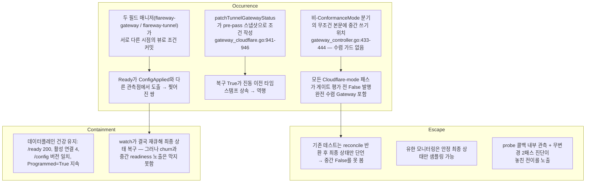

# Flareway 설계 002 — CloudflareTunnel 상태 조건 일관성: 조건 전용 공유 SSA 매니저

- 작성일: 2026-09-22
- 상태: **조사·설계 제안. 이 문서는 어떤 수정·CI 통과·회귀 없음도 주장하지 않는다.** AtomicityReview가 이 수정 버전에 무조건 서명했다 — 서명 범위는 설계와 QA 목록뿐이며, 매니저 churn과 수정 후 동작은 미측정으로 남고, 구현은 이 서명이 아니라 사용자 승인 범위 아래 진행된다.
- 입력: [isac322/flareway#92](https://github.com/isac322/flareway/issues/92) 본문과 실행된 재현 코멘트, 실행된 envtest 진단 2건, `dd322e3ec216a64425489045bfde2e5def3080bc` 소스 감사, AtomicityReview와 합의한 설계.
- 표기: `[E]` 실행된 증거(envtest 실 API 서버), `[L]` 라이브 클러스터 관측, `[S]` 소스·이력 감사(실행 없이 코드로 확인), `[P]` 설계 제안(미실행), `[?]` 미측정·미해결.
- 관련 문서: [설계 001](001-cloudflare-gateway-api-integration.md)(필드 매니저 분할의 원래 계약), [QA 목록](../qa/issue-92-status-consistency.md)(제안된 검증 항목 — 실행 결과와 구분할 것).

---

## 1. 요약

수렴한 Gateway의 reconcile이 매 패스마다 `CloudflareTunnel.status.conditions`에 `ConfigApplied=False(Pending)`을 중간 발행한 뒤 같은 패스 안에서 `True`로 복구한다 `[E][L]`. 복구된 `True`는 진동 이전의 `lastTransitionTime`을 물려받아 타임스탬프가 거꾸로 간다 `[E][L]`. Tunnel 컨트롤러는 자기 사전 스냅샷의 `ConfigApplied`로 `Ready`를 계산해 별도 필드 매니저로 커밋하므로, 두 조건이 같은 객체의 서로 다른 뷰에서 발행되어 `(ConfigApplied=False, Ready=True)` 찢어진 쌍이 지속된다 `[E][L]`.

제안: `status.conditions`만 소유하는 공유 SSA 매니저 `flareway-tunnel-status`를 도입하고, 신선한 APIReader 읽기 + `resourceVersion` CAS 트랜잭션으로 조건을 커밋한다. 데이터 필드(`configVersion`, `hostnames`, `listeners`, `dnsRecords` 등)는 기존 매니저에 남긴다. `Ready`는 같은 문서 안에서 원자적으로 도출한다. 원격 변경 전 내림(demotion)을 내구 커밋하고, 반환된 버전을 게이트 전에 체크포인트한다. 수렴 패스는 live와 deep-equal이면 쓰기를 0건으로 한다 `[P]`.

---

## 2. 확정 사실과 증거 등급

| # | 주장 | 등급 | 근거 |
|---|---|---|---|
| C-1 | 수렴 패스가 게이트 평가 전 `ConfigApplied=False`를 지속(persist)하고 게이트 후 `True`를 지속한다 | `[E]` | envtest 진단: probe 콜백 안에서 mid-gate 지속 상태를 직접 읽어 `False/Pending` 확인, 패스 종료 `True/Applied` 확인(2개 연속 무변경 패스) |
| C-2 | 복구된 `True`의 `lastTransitionTime`이 직전 `False`보다 과거로 되돌아간다 | `[E]` | 진단: `False` 21:02/21:03 지속 후 `True`가 21:01로 기록. `gatewayTunnelCondition`이 pre-pass 스냅샷의 기존 타임스탬프를 상속하기 때문 `[S]` |
| C-3 | `(ConfigApplied=False, Ready=True)` 찢어진 쌍이 실제 API 서버에 지속된다 | `[E]` | 교차 작성자 진단: 시드 `(True,True)` → 프로덕션 Gateway 작성자의 실제 `ConfigApplied=False` 쓰기 후 `(False,True)` 지속. stale tunnel 스냅샷 작성자는 `Ready=True`를 원래 타임스탬프로 부활. fresh-read 대조군은 `(False,False)`로 일관 |
| C-4 | 라이브에서도 동일 패턴(찢어진 쌍, 역행 타임스탬프, 매 샘플 tunnel resourceVersion 증가)이 관측됐다 | `[L]` | 이슈 본문 감사: 8개 스냅샷, `ConfigApplied=True`+`Ready=False` 및 `Ready=True`+`ConfigApplied=False` 공존, Gateway resourceVersion·spec·데이터플레인은 안정 |
| C-5 | Gateway의 tunnel watch(`gateway_controller.go:1718`)와 tunnel의 `For`(`cloudflaretunnel_controller.go:2877`)에 predicate가 없어 모든 tunnel status 쓰기가 양 컨트롤러를 재큐한다 | `[S]` | 코드 확인. 매니저 churn의 실측(재큐 횟수·CPU)은 미실행 `[?]` |
| C-6 | 라이브 메트릭 윈도우: 40.7521초에 Gateway reconcile 103회(전부 `requeue_after`, 오류 0), 단일 워커 점유 ~99.6%, Cloudflare API 141회 | `[L]` | 상관 관측이며 개별 호출의 귀인은 주장하지 않는다(이슈 본문 명시) |
| C-7 | `status.conditions`는 `+listType=map`/`+listMapKey=type`이다 | `[S]` | `api/v1alpha1/cloudflaretunnel_types.go:601-603`. SSA에서 문서에 없는 외부 타입 엔트리는 untouched·unowned로 남는다 |
| C-8 | `metadata.resourceVersion`을 실은 status SSA apply는 낙관적 동시성 검사로 동작한다 | `[E]` | envtest 1.35 실행: 동일 매니저 무변경 apply는 resourceVersion 313→313 유지, stale RV + ForceOwnership은 409 Conflict로 최신 상태 보존, RV 없는 대조군은 성공. 저장소 내 선례: `gateway_controller.go:1580-1586`이 Gateway 소유 객체에 `SetResourceVersion` + apply를 이미 사용 `[S]` |
| C-9 | 결함 도입 커밋은 `ca39104ee6d679dc1925a009d359076c7d6ac196`(2026-09-15)이며 v0.1.0–v0.2.0 태그에서 도달 가능 | `[S]` | `git log -S` 바운드. 실행 검증은 v0.2.0(`dd322e3`)뿐이며 이전 태그는 소스 수준 바운드다 |
| C-10 | 라이브 배포는 v0.2.0 이미지(`sha256:ec6fdb5f…`)로 보고됐으나 본 조사에서 재질의하지 않았다 | `[L]` | 이슈 코멘트 기재값 |

증거 경계: 진단 스펙은 매니저의 watch/enqueue 경로를 실행하지 않으므로 C-5의 churn은 소스 관측이고 실측이 아니다. 두 진단 모두 **PASS가 결함 존재를 확인**하는 것이지 수정을 증명하지 않는다.

---

## 3. 인과 그래프 (발생 / 탈출 / 봉쇄)

- **발생**: 중간 쓰기가 수렴 가드 없는 무조건 경로에 있다 `[S]`; 라이브에서 `Programmed`가 전 윈도우 `True`/불변 타임스탬프를 유지해 pending early-return이 아님을 독립적으로 닫는다 `[L]`.
- **탈출**: 최종 상태 단언과 유한 샘플링은 중간 쓰기를 놓친다. 실행된 진단은 지속 객체를 게이트 도중에 읽어 이 공백을 증명했다 `[E]`.
- **봉쇄**: 트래픽 손실 없음. 자기 복구는 churn을 막지 못하며, 조건을 읽는 소비자(`kubectl wait`, GitOps health, 알림)는 임의 시점에 거짓 `False`를 관측할 수 있다 `[L]`.

---

## 4. 근본 원인 — 두 개의 독립 메커니즘

1. **패스 내 비관적 중간 쓰기** `[E][S]`: `gateway_controller.go:433-444`의 pre-gate `patchTunnelGatewayStatus`가 `metav1.ConditionFalse`를 하드코딩하고, `:523-530`의 post-gate 쓰기가 실제 판정을 쓴다. 둘 다 `Reconcile` 진입 시 읽은 스냅샷으로 조건을 만들어, 복구 `True`가 진동 이전 `lastTransitionTime`을 상속한다(`gateway_cloudflare.go:941-946`).
2. **교차 작성자 비일관 뷰** `[E][S]`: tunnel 컨트롤러는 `setReady`/`setReadyForMode`(`cloudflaretunnel_controller.go:2497,2512`)에서 자기 스냅샷의 `ConfigApplied`로 `Ready`를 도출해 `flareway-tunnel` 매니저로 커밋하고, `ConfigApplied`는 `flareway-gateway` 소유다. 실행된 교차 작성자 진단이 stale 스냅샷 쓰기로 `Ready=True` 부활을 재현했다.

두 메커니즘은 독립적이다: 하나만 고치면 다른 하나가 남는다(§5 반례).

---

## 5. 대안 비교와 반례

| 대안 | 설명 | 해결하는 것 | 반례 / 한계 |
|---|---|---|---|
| A. Gateway-only 수정 | pre-gate 쓰기가 지속된 `ConfigApplied`를 verbatim 이어쓰고 post-gate만 판정 | 패스 내 False→True 진동과 역행 타임스탬프 | 교차 작성자 찢어짐을 못 고친다: tunnel 컨트롤러는 여전히 자기 스냅샷으로 `Ready`를 도출해 별도 매니저로 커밋. 실행된 진단에서 stale tunnel 쓰기가 `(False,True)`를 재생성 `[E]`. 패스당 2회 쓰기와 자기 재큐도 잔존 |
| B. Fresh-read + per-writer CAS | 각 작성자가 apply 직전 live를 읽고 RV CAS로 직렬화 | stale 뷰 기반 쓰기 | 중간 `False`의 외부 가시성과 쓰기당 wakeup은 그대로 — 수용 기준 1(중간 False 비발행) 불충족. `Ready`는 여전히 `ConfigApplied`와 다른 문서에서 도출되어, 독자가 두 커밋 사이를 읽으면 찢어진 쌍 관측 가능 |
| C. Ready를 Gateway 매니저로 이전 | Gateway가 `Ready`까지 계산·기록 | Gateway-mode에서 Ready/ConfigApplied 동일 문서 | `Ready`의 입력 `TunnelReady`/`DNSReady`는 tunnel 소유이며 Direct 모드·ObserveOnly·자격증명 실패·삭제/드레인 경로는 Gateway가 관여하지 않는다. 두 매니저가 `Ready` 엔트리를 번갈아 쓰면 소유권 이전이 managedFields fieldset을 바꾸는 실제 객체 변경이라 매번 RV를 올려 영구 churn `[S]`(소스 수준 주장: `IgnoreManagedFieldsTimestampsTransformer`는 managedFields 타임스탬프만 무시하고 fieldset 이동은 무시하지 않는다. C-8의 실행 증거는 동일 매니저 무변경·stale RV·무RV 대조군만 덮으며 소유권 이전을 측정하지 않았다). 교번 매니저 churn의 실측은 없다 `[?]` |
| D. 전체 status 공유 매니저 | 모든 status 필드를 단일 트랜잭션으로 | 최대 일관성 | 과광범위: `configVersion`/`dnsRecords`/`clients` 등은 freshness·clear-intent(`tunnelStatusClear`) 의미가 달라 조건 트랜잭션에 섞이면 양쪽 컨트롤러의 status 경로 전체를 재작성해야 하고 실패 반경이 커진다 |
| **E. 조건 전용 공유 SSA 매니저(제안)** | `flareway-tunnel-status`가 `status.conditions`만 소유, APIReader + RV CAS 트랜잭션, `Ready` 동일 문서 도출 | 찢어진 쌍·역행 타임스탬프·중간 False·자기 재큐 | §6. 데이터 필드는 기존 매니저에 남아 침입 범위가 조건으로 한정된다 |

---

## 6. 제안 설계 `[P]` — AtomicityReview 합의안

### 6.1 소유권

- 새 필드 매니저 `flareway-tunnel-status`는 `CloudflareTunnel`의 `status.conditions` 중 **Flareway 조건 타입 집합만** 소유한다.
- 기존 매니저는 데이터 필드를 유지한다: `flareway-tunnel`은 `tunnelId`/`dnsRecords`/`clients`/`addresses`/소유권 필드, `flareway-gateway`는 `configVersion`/`hostnames`/`listeners`. 이 필드들에는 마이그레이션이 없다.
- 외부(비-Flareway) 조건 타입은 **문서에서 생략해 보존**한다. `listType=map`이므로 생략된 외부 엔트리는 untouched·unowned다(C-7). 외부 엔트리를 문서에 싣는 것은 소유권 탈취이므로 금지한다.
- 주의: 이 분할은 invariant G4가 아니다. G4는 **원격 tunnel config**의 단일 작성자 규칙이며 Kubernetes status 소유권 규칙이 아니다.
- Direct 모드도 같은 트랜잭션을 쓴다: tunnel 컨트롤러가 `ConfigApplied`를 같은 공유 매니저와 같은 클램프로 작성하며, Gateway는 Direct-mode tunnel에 대해 계속 거부된다(`patchTunnelGatewayStatus`의 mode 검사 유지).

### 6.2 조건 트랜잭션

1. APIReader로 신선하게 읽어 RV 기준(basis)을 잡는다.
2. 출처(provenance) 전제조건 검사(§6.4).
3. 비작성 Flareway 엔트리를 그 읽기에서 **verbatim** 이어쓴다(`lastTransitionTime`·`observedGeneration` 포함, 재스탬프 금지).
4. 작성 엔트리를 오버레이한다. `lastTransitionTime`은 **live 엔트리**와 비교한다: 같은 Status면 live 시각 유지, 바뀌면 now.
5. `Ready`를 같은 문서 안에서 도출한다(§6.3).
6. `metadata.resourceVersion`을 실어 `flareway-tunnel-status` + ForceOwnership으로 apply한다.
7. 409 Conflict면 재읽기 후 두 tier 전제조건(§6.4)을 새 리비전에 대해 재평가하고 **같은 델타**를 재병합해 유한 재시도(3회). 재관측·원격 액션 재실행은 절대 하지 않는다.

### 6.3 Ready 규칙

- 문서가 `Ready` 입력(`TunnelReady`, `ConfigApplied`, `DNSReady`)을 작성하거나 명시적 `Ready` 오버라이드를 줄 때만 도출한다. 그 외에는 live `Ready`를 verbatim 이어쓴다.
- 무조건 클램프: 병합 결과 `TunnelReady && ConfigApplied && DNSReady`가 모두 True일 때만 `Ready=True`. 이 클램프가 업그레이드 시 이미 찢어진 객체를 수리한다.
- `ObserveOnly`는 자기 사유로 `Ready=False`를 강제한다. 명시적 False 사유(ObserveOnly, conflict, cleanup)가 도출 사유보다 우선한다.

### 6.4 패스 내 순서와 내구 무효화

- **매 패스 조건 단계가 데이터 apply보다 먼저** 실행된다(§6.6 마이그레이션과 같은 이유: 데이터 전용 apply가 conditions를 생략하면 구 매니저 소유 엔트리가 삭제된다).
- 순서 규칙은 방향성이다: **정당화하는 데이터가 내구화되기 전에 긍정 승격(positive promotion)을 커밋해서는 안 된다. 내림 — 안전 클램프 포함 — 은 어느 지점에서든 커밋할 수 있으며 데이터 apply보다 먼저 둔다.**
- 원격 변경 전 내구 무효화: `reconcileCloudflaredConfiguration`의 `WithTunnelLock` 클로저 안, `api.UpdateTunnelConfiguration`(`gateway_cloudflare.go:661`) **직전** 콜백에서 — no-change/drift-Hold 분기 이후 — (a) 조건 트랜잭션만 커밋한다: `ConfigApplied=False`(reason `Applying`)와 같은 문서에서 도출된 `Ready=False`. 의도한 hash는 조건 메시지에만 나타나며 게이트가 소비하는 상태에는 절대 쓰지 않는다. (b) push 전 데이터 apply는 **없다** — `configVersion.Desired`/`DesiredHash`는 마지막으로 성공한 push의 기록으로 남는다. (c) 원격 변경. (d) 성공 시 `DesiredHash`=신규, `Desired`=`Remote`=반환 버전, `AppliedAt`을 담은 단일 데이터 체크포인트를 게이트 전에 커밋한다. **불변식: `configVersion.Desired`와 `DesiredHash`는 마지막 성공 원격 push의 기록이며 추측적으로 쓰지 않는다** — 내구적 pre-mutation 무효화는 전부 조건에 있고, 그것이 fail-closed 요구가 실제로 필요로 하는 전부다. hash를 push 전에 지속하면 in-lock no-change 분기 — 조건: `Desired > 0`이고 persisted `DesiredHash`가 컴파일 hash와 같고 `remote.Version`이 `Desired`와 같음(`gateway_cloudflare.go` 내, 동시 편집 중이라 행 번호는 근사치) — 가 실패한 push 다음 패스에서 persisted `DesiredHash`와 불변 `remote.Version`을 매치해 재push를 영구 생략하고 `appliedAt`까지 스탬프해 D11 freshness 게이트를 다시 연다 — 스스로를 강화하는 정체다. push 실패 시 롤백은 없다: 다음 패스가 같은 hash를 재컴파일해 persisted `DesiredHash`와 다름을 보고 다시 push한다. at-least-once 계약에 이미 있는 유한 케이스: 성공한 push와 체크포인트 사이의 크래시는 remote를 baseline보다 앞서게 하므로 다음 패스가 drift 분기를 타고, `DriftPolicy: Hold`에서는 자기 중단 push를 out-of-band change로 보고한다.
  - **Tier 1 — 모든 커밋에 필수(내림 포함), 작성자별로 구분된다**:
    - **공통(양 작성자)**: live UID가 이 패스가 관측한 UID와 같고, live `metadata.generation`이 이 패스가 컴파일한 generation과 같고, live `spec.configuration.mode`가 관측된 mode와 같으며 이 작성자가 그 mode 아래 자신이 작성하는 조건 타입의 권위자다(Gateway: `ConfigApplied`, `PrivateListenerDegraded`, `DriftDetected` — Gateway mode에서만; tunnel: Direct mode에서만 `ConfigApplied`, 그리고 항상 `Accepted`, `TunnelReady`, `DNSReady`, `Ready`, `CleanupBlocked`, `Conflict`). 어느 하나라도 불일치하면 쓰기 없이 중단하고 재큐한다. 내림도 이 전제를 강제로 넘지 않는다.
    - **Gateway 작성자 추가**: live `status.deletedAt`이 nil이고, live `status.ownershipVerified`가 true이며, live `status.gatewayRef`/`status.gatewayUid`가 이 Gateway의 live UID를 지목하고, live Gateway가 존재하며 `deletionTimestamp`가 0이고, drain이 pending이 아니다. 이들은 `validateGatewayTunnelWriter`의 기존 조건을 캐시가 아닌 RV 기준 읽기에 대해 평가한 것이다.
    - **Tunnel 작성자**: 소유권·`deletedAt`·`ownershipVerified` 게이트가 **없다** — UID·generation·mode와 자기 mode에 적용 가능한 승격 증거만 검증한다. tunnel 컨트롤러는 `ownershipVerified`·`gatewayRef`/`gatewayUid`·`deletedAt`을 세우는 권위자이므로 자기 커밋을 그 값들로 게이트하면 초기 프로비저닝·ObserveOnly·미소유·자격증명 실패·teardown 상태를 쓰기 불가로 만드는 데드락이다. 정당한 라이프사이클 변경(초기 프로비저닝, ObserveOnly 전환, ownership conflict, teardown)은 쓰기 가능해야 한다.
  - **Tier 2 — `ConfigApplied=True`의 작성자에게만 추가 필수. mode 범위로 구분되며 도메인 간 비교는 없다**:
    - **Gateway mode — 세 독립 도메인을 각자의 단위로 판정**:
      - xDS 도메인: ACK 트래커가 이 패스가 발행한 정확한 컴파일 스냅샷 identity — `translator.SnapshotVersion`이 그 스냅샷에 대해 반환한 문자열(`internal/xds/translator/translator.go:178`) — 의 ACK를 보고한다. 불투명 identity이며 숫자가 아니고 Cloudflare 버전과 절대 비교하지 않는다.
      - Cloudflare 도메인: 모든 활성 cloudflared Pod가 이 패스가 적용한 int64 버전과 같은 `/config` 버전을 보고하고, live `status.configVersion`의 `Desired`/`DesiredHash`/`Remote`가 이 패스가 컴파일·관측한 값과 여전히 같다.
      - DNS 도메인: 컴파일된 모든 public 리스너 hostname이 live `status.dnsRecords`에 비충돌 레코드를 가진다(External DNS 모드는 생략). 게이트는 `DNSReady` 조건이 아니라 `status.dnsRecords`를 소비한다.
    - **Direct mode**: tunnel 작성자가 자기 원격 apply 결과(`cloudflaretunnel_controller.go:1483`)로 `ConfigApplied=True`를 작성하며 live `configVersion` 일치를 요구한다. DNS 준비는 `ConfigApplied`를 게이트하지 않고 tunnel 소유 `DNSReady`에 실린다.
    - 어느 도메인이라도 실패하면 이 패스의 승격은 포기한다: 커밋이 실행되지 않거나 내림으로만 실행된다. `Ready` 클램프는 변경 없이 mode 무관이다.
  - `Ready` 도출에는 Tier 2가 적용되지 않는다 — 클램프만으로 충분하다. 병합된 `ConfigApplied`는 RV 기준 읽기에서 verbatim 이어쓰며, 그 값 자체가 작성 시점에 Tier 2를 통과한 것이다. 이 전이적 논거가 `Ready` 작성자가 게이트 관측을 보유하지 않아도 클램프가 충분한 이유다.
- **교차 객체 한계(과장 금지)**: CAS는 `CloudflareTunnel` 객체 하나만 덮는다. Gateway는 별개 객체이며 `ir.Gateway`는 UID만 운반한다 — translator가 Key+UID만 복사하고 generation은 없으므로, 커밋 직전 live 읽기가 재검증하는 것은 Gateway UID와 `deletionTimestamp`뿐이다(tunnel generation은 공통 헬퍼가 CloudflareTunnel의 것을 검사). **유한 TOCTOU가 남는다**: Gateway spec은 그 live UID/deletion 읽기 이전에 이미 stale일 수 있고, 읽기와 tunnel status 커밋 사이에도 바뀔 수 있다. 결과는 기껏해야 직전에 대체된 Gateway spec을 기술하는 `ConfigApplied` 하나이며, 변경된 spec의 watch 이벤트가 다음 패스를 큐해 재계산·재발행한다. `Ready`는 같은 문서에서 도출되므로 찢어진 쌍은 아니다. 이 설계는 교차 객체·spec-generation 원자성을 주장하지 않는다 — 이 한계는 기존 경계이며 새 런타임 버그가 아니고, IR/API 범위 추가를 요구하지 않는다. tunnel 조건의 `observedGeneration`은 CRD 관례대로 CloudflareTunnel generation을 유지하며 Gateway generation을 위한 새 필드를 만들지 않는다.

### 6.5 수렴 패스

- 병합된 소유 집합이 live와 deep-equal이고 §6.6의 소유권 조건을 만족하면 조건 단계는 쓰기를 건너뛴다. 수렴 패스는 추측성 `Pending`을 발행하지 않고 **실효 status 쓰기 0건**이다. 이것이 자기 재큐 루프를 끊는 메커니즘이다 — watch를 필터링하는 것이 아니라 쓸 것이 없게 만든다.

### 6.6 마이그레이션(규범적 순서)

- 조건 단계의 no-op skip은 정확히 이 조건에서만 허용한다: 병합된 소유 집합이 live와 deep-equal **이고**, `flareway-tunnel-status`가 live에 존재하는 **모든 Flareway 조건 엔트리를 소유**할 때. 안전 조건은 "다른 매니저가 하나도 소유하지 않음"이 아니라 공유 매니저의 전수 소유다 — 공동 소유(co-ownership)만으로도 삭제 위험은 이미 제거되므로, 배타성을 요구하는 술어는 데이터 apply가 건너뛰어지는 tunnel에서 매 패스 apply를 강제할 수 있다(이 마지막 결과는 술어의 형태에서 따르는 추론이며 미실행 `[?]`). 술어는 타입 단위다 — "status.conditions 아래 임의 경로"로 하면 정당한 외부 소유 커스텀 조건이 skip을 영구 비활성화해 매 패스 쓰게 된다.
- 레거시 소유권이 남아 있는 패스의 첫 조건 트랜잭션은 **소유권 청구(claim)**다: 전체 Flareway 집합의 현재 live 값을 verbatim으로 싣는다 — 단 한 가지 예외로, 무조건 `Ready` 클램프는 항상 적용되며 조건을 fail-closed 방향으로만 움직일 수 있다. 청구는 새로운 True를 작성하지 않고, 없는 엔트리를 발명하지 않고, 변경하지 않는 엔트리를 재스탬프하지 않는다. 클램프가 발화해 `Ready`가 실제로 True→False로 전이하면 `lastTransitionTime`은 now로 스탬프한다 — 실제 전이이지 재작성이 아니다. 이후 패스는 정상 진행한다.
- **소유권 이전은 한 번의 쓰기가 아니라 2단계다.** SSA 충돌은 applier가 다른 매니저 소유 필드를 *변경*할 때만 발생하므로, 동일 값을 apply하면 충돌이 아니라 **공동 소유**가 된다 — ForceOwnership은 공유 소유권이 아니라 충돌 값을 해소한다(실행 확인 `[E]`: 첫 커밋 후 `flareway-tunnel`과 `flareway-tunnel-status`가 같은 조건 엔트리를 공동 소유). 순서를 안전하게 만드는 실제 메커니즘은 더 강한 명제다: **SSA는 owned-but-omitted 필드를 다른 매니저가 여전히 소유할 때는 삭제하지 않는다.** 따라서 공유 매니저가 조건 엔트리를 청구한 뒤에는 구 매니저의 conditions-생략 데이터 apply가 자기 claim만 내려놓고 엔트리는 살아남는다. 청구가 생략보다 먼저여야 하는 이유가 이것이며, force와 무관하다. 배타적 소유는 구 소유자가 놓은 뒤 저절로 도달하며, 부담을 지는 요소가 아니라 표면적 결과다.
- 찢어진 객체는 병합 `Ready=False`와 live `Ready=True`가 달라 deep-equal이 아니므로 fast path가 건너뛸 수 없다 — QA-92-31의 레거시 수리는 한 패스 안에서 성립한다.

### 6.7 watch·라이프사이클 제약

- `gateway_controller.go:1718`의 tunnel watch와 `cloudflaretunnel_controller.go:2877`의 `For`에 `GenerationChangedPredicate`류의 일괄 필터를 **두지 않는다**. Gateway는 tunnel status 필드(`tunnelId`, `ownershipVerified`, `connectorTokenSecretRef`, `deletedAt`, `dnsRecords`)에 정당하게 의존하고, tunnel 컨트롤러도 원격 TunnelID 배정·adoption·자격증명 검증을 위한 status-only wakeup이 필요하다. 루프는 쓰기 제거로 끊는다.
- `lastTransitionTime`은 의미 있는 Status 전이에만 바꾼다. `appliedAt`은 별개의 게이트/관측 필드로 유지하고 조건 전이 의미를 재정의하지 않는다. 실제 오류를 디바운스·은폐·억제하지 않는다.

### 6.8 비멱등 원격 생성과 identity 캡처

- **순서**: `status.tunnelId`가 비어 있을 때, veto 가능한 조건·마이그레이션 단계는 비멱등 create(`ensureRemoteTunnel`의 `CreateTunnel`)보다 **먼저** 실행된다. 여기서 중단해도 원격 리소스가 아직 없으므로 비용이 없고, 뒤따르는 캡처가 쓸 `/status` 서브리소스의 존재를 보장한다. (정정: "`Accepted`가 이미 status를 만든다"는 이전 전제는 폐기한다 — `cloudflaretunnel_controller.go`의 `Accepted=True` 설정은 인메모리 조건 슬라이스만 변경하며, `ensureRemoteTunnel` 이전의 status apply는 실패 분기뿐이다.)
- **캡처**: create가 반환하는 즉시, identity는 기존 `flareway-tunnel` 매니저 아래 status 서브리소스에 대한 identity 전용 **RFC 6902 JSON Patch**로 기록된다. `/metadata/uid`에 `test` op 하나만 두고 generation·resourceVersion 전제조건은 없다. 원격 identity는 spec과 무관한 진실이므로 spec 편집이나 조건 충돌이 그 기록을 거부할 수 없다.
- **필드 집합**: `remoteProjectionEqual`이 비교하는 원격 프로젝션을 단위로, 정확히 `tunnelId`, `accountId`, `name`, `tunnelType`, `configSource`, `connectorState`, `createdAt`, `deletedAt`, `connectionsActiveAt`, `connectionsInactiveAt`, `ownershipVerified`(구현 `tunnelRemoteIdentityFields`와 일치). 자격증명 Secret ref는 제외한다. 부분 캡처는 고치려는 버그보다 나쁘다: `tunnelId`가 있고 `ownershipVerified`가 false이며 명시적 `AdoptById`가 없는 Managed tunnel은 하드 conflict를 반환하고(`ensureRemoteTunnel`), `GetTunnel`로 돌아가는 유일한 경로도 `ownershipVerified`를 요구하므로, `tunnelId`만 캡처하면 중복 생성 누수를 영구 복구 불가 adoption conflict로 바꾼다. ref를 제외하는 이유는 `ensureTokenSecret`/`ensureManagementTokenSecret`이 뒤 단계에서 실행되고 G6는 status 포인터가 아니라 컨트롤러 소유 Secret으로 충족되며, 포인터는 결정적 이름으로 재도출 가능하기 때문이다. `observedGeneration`은 명시적으로 제외한다: 캡처는 원격 진실만 싣고, `observedGeneration`은 원격이 반환한 것이 아니라 컨트롤러가 관측한 spec generation이라는 지역 관측이다. 이 캡처가 generation 전제조건을 갖지 않는 것은 spec 편집이 이미 존재하는 tunnel의 기록을 거부하지 못하게 하려는 의도인데, 같은 무조건 경로로 generation 파생 상태를 쓰면 live가 이미 N+1인 시점에 "generation N을 관측했다"고 주장하게 된다 — Tier 1의 generation 검사가 막으려는 재스탬프를 면제된 유일한 쓰기로 되돌리는 셈이다. 따라서 제외는 구현 세부가 아니라 면제를 좁게 유지하는 장치다.
- **conditions-first 규칙과의 관계(구조적)**: 그 규칙은 SSA가 매니저 소유 필드를 문서 생략 시 삭제하기 때문에 존재한다. JSON Patch에는 생략 의미가 없으므로 조건 엔트리를 삭제하거나 소유권을 옮길 수 없어 규칙을 침해하지 않는다. 오류 분류: 실패한 `test` op는 409 Conflict가 아니라 **422 Invalid**로 표면화된다.
- **기술하지 않는 것**: 일회성 토큰 손실은 없다(`GetTunnelToken`은 재조회 가능한 일반 호출). recreate 케이스에 대해서도 대체 UID에 identity를 붙이지 않는 것 이상의 orphan 보고 경로는 규정하지 않는다. 기술할 해악은 기록되지 않은 원격 tunnel과 다음 패스의 중복 생성뿐이다.

---

## 7. 제안 변경 범위 (승인 대기 — 런타임 편집 없음)
| 파일 | 심볼·위치 | 변경 요지 |
|---|---|---|
| `internal/controller/gateway_controller.go` | `patchTunnelGatewayStatus` 호출부 `:433`, `:523`; `GatewayReconciler` | `:433`은 `ConfigApplied=False` 하드코딩을 멈추고 패스가 applied 상태를 무효화할 때만 False를 작성; reconciler에 `APIReader` 필드 추가 |
| `internal/controller/gateway_cloudflare.go` | `patchTunnelGatewayStatus` `:892`, `gatewayTunnelCondition` `:941`, `reconcileCloudflaredConfiguration` `:559` | `:892`는 conditions를 공유 매니저 경로로 이관; `:941`은 pre-pass 스냅샷 대신 RV 기준 live 엔트리로 스탬프; `:559`에 `UpdateTunnelConfiguration` 직전 pre-mutation 콜백 추가 |
| `internal/controller/cloudflaretunnel_controller.go` | `setReady` `:2497`, `setReadyForMode` `:2512`, `patchOwnedStatus` `:2630`, `tunnelOwnedConditions` `:2468`, `commitTunnelConditions`, `persistRemoteIdentity`, `tunnelRemoteIdentityFields` | `:2630`은 conditions를 공유 매니저로 이관; `:2468`은 작성 집합 정의로 전환; `Ready` 도출은 트랜잭션 내로 이동; `commitTunnelConditions`는 공유 조건 트랜잭션의 tunnel 작성자 진입점, `persistRemoteIdentity`는 §6.8의 identity 캡처 |
| 신규 공유 조건 헬퍼 | 파일·패키지는 구현 리뷰에서 확정 | §6.2 트랜잭션 + §6.3 Ready 규칙 + §6.6 마이그레이션 술어 |
| `cmd/main.go` | `:322` `GatewayReconciler` 초기화 | `APIReader: mgr.GetAPIReader()` 배선 |
| `internal/controller/suite_test.go` | `:100` `GatewayReconciler` 초기화 | `APIReader` 배선 |
| 테스트 파일 | 진단 스펙 2종 | 수정 후 실패해야 하는 진단 스펙의 처리(전환 또는 제거)는 구현 범위에서 결정 |

열거 한계(리뷰어 grep 검증, 최종 구현 리뷰에서 재확인 예정): `cloudflaretunnel_controller.go`에 `patchOwnedStatus` 호출 30곳, `Ready` 계산 20곳(`setReady` 10 + `setReadyForMode` 10), `activeFailure` 6곳. 30곳 중 10곳(삭제 경로 9 + `:522` identity 체크포인트)은 의도적으로 `Ready`를 재계산하지 않고 verbatim 이어써야 한다. Gateway 측 tunnel status 작성자는 `patchTunnelGatewayStatus`뿐이며 호출 2곳.

기존 테스트 영향: 중간 `ConfigApplied=False` 쓰기를 고정(pin)하는 unit/envtest는 없다 — `patchTunnelGatewayStatus`의 유일한 직접 테스트 호출자는 `gateway_cloudflare_envtest_test.go:118`로 명시적 조건을 넣어 작성자를 구동한다. 따라서 pre-gate 쓰기를 조건부로 바꿔도 삭제할 테스트가 없고, churn·순서 속성은 재고정이 아닌 신규 커버리지다 `[S]`.

---

## 8. 이슈 수용 기준 매핑

| #92 수용 기준 | 설계 대응 |
|---|---|
| 수렴 패스가 평가 중이라는 이유만으로 중간 `ConfigApplied=False`를 외부 발행하지 않는다 | `:433`이 지속 조건을 이어쓰고 무효화 시에만 False 작성; 수렴 패스 쓰기 0건(§6.5) |
| 버전 불변·적용 완료 시 단일 멱등 커밋; 버전 전진 시 수렴 평가 전 내구 not-yet-applied 체크포인트로 abort fail-closed; 무변경 반복 패스는 전이 타임스탬프·churn 없음 | §6.4 pre-mutation 내구 무효화 + 반환 버전 체크포인트; live 비교 스탬프(§6.2-4) |
| `ConfigApplied`와 `Ready`가 비일관 뷰에서 발행되지 않음; `lastTransitionTime`이 최근 실제 전이를 반영 | 조건 전용 단일 매니저 + 동일 문서 `Ready` 도출 + live 기준 스탬프(§6.1–6.3) |
| 정당한 pending/실패 관측 가능 — 실제 probe/데이터플레인 실패, 원격 배정·adoption·자격증명의 status-only wakeup | 내림은 데이터 apply 전 즉시 커밋; watch에 일괄 필터 없음(§6.7); un-ACKed 대조군 케이스 보존 |
| 안정 spec·건강 데이터플레인의 유한 재현에서 진동 없음, 기록된 기준(103 reconciles/40.5819 worker-초/40.7521s) 대비 현저히 감소 | 쓰기 0건이 자기 재큐를 제거. **수치 목표는 수정 후 측정으로만 확인 가능 — 현재 미측정 `[?]`** |
| `Ready=True`는 요구 조건이 실제 수렴할 때만 | 무조건 클램프(§6.3) |
| 격리된 컨트롤러/파이프라인 테스트가 중간 평가와 실제 pending/실패를 구분하고 외부 관측 status 시퀀스를 단언 | 실행된 진단 스펙이 이미 그 관측 지점을 증명; 수정 후 회귀 테스트로의 전환은 구현 범위. QA 후보는 [QA 문서](../qa/issue-92-status-consistency.md) 참조 |

---

## 9. 미해결·미측정 항목 `[?]`

- 매니저 watch churn의 실측(재큐 빈도·워커 점유)은 실행되지 않았다. C-5는 소스 관측이다.
- 수정 후 동작(진동 제거·reconcile 빈도 감소)은 어떤 환경에서도 검증되지 않았다. 회귀 없음을 보장하지 않는다.
- 라이브 배포 상태는 보고값이며 재질의하지 않았다(C-10).
- 공유 헬퍼의 파일·패키지 위치와 호출부 열거는 최종 구현 리뷰에서 확정한다.
- 런타임 구현은 명시적 범위 승인 대기 중이다. 이 문서는 설계 합의(AtomicityReview)를 기록하며 실행된 수정을 주장하지 않는다.
